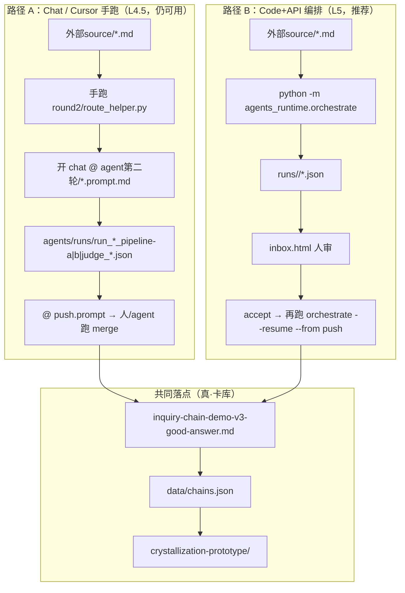
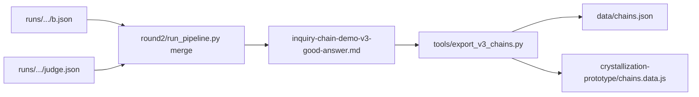

# Agentflow 代码地图（Code Map）

> **目的**：解决「文件夹太多、不知道哪条链路在跑」的混乱。  
> **依据**：2026-05-21 仓库真实目录与文件（非理想态）。  
> **母计划**：[plan-chat-to-code-api.md](./plan-chat-to-code-api.md)（Phase 1–5 总览）

---

## 1. 客观进度（Phase 1–5）

| Phase | 计划文档 | 代码/产物 | 状态 | 你怎么用 |
|-------|----------|-----------|------|----------|
| **1** prompt → callable | [phase1-prompt-callable.md](./phase1-prompt-callable.md) | `agents_runtime/`（loader / context_builder / llm_client / agents） | **已落地** | `from agents_runtime import run_a, run_b, run_judge` 或 CLI 子模块 |
| **2** orchestrator | [phase2-orchestrator.md](./phase2-orchestrator.md) | `agents_runtime/orchestrate.py` + `run_state.py` + `_subprocess.py` | **已落地** | `python -m agents_runtime.orchestrate 外部source/xxx.md` |
| **3** eval harness | [phase3-eval-harness.md](./phase3-eval-harness.md) | （应有 `agents_runtime/eval.py` + `eval/suites/`） | **未做** | 改 prompt 后仍靠人工对比 JSON |
| **4** inbox UI | [phase4-inbox-ui.md](./phase4-inbox-ui.md) | `crystallization-prototype/inbox.html` + `runs/_index.py` | **已落地** | file:// 打开 inbox；accept/reject **只复制命令** |
| **5** few-shot RAG | [phase5-retrieval-rag.md](./phase5-retrieval-rag.md) | （应有 `agents_runtime/retrieval.py`） | **未做** | few-shot 仍靠 prompt 内嵌或人工选卡 |

**额外工程（不在 Phase 表里，但已存在）**

| 项 | 位置 | 说明 |
|----|------|------|
| B 风格 SSOT | `context/pipeline-b-style-lexicon-v1.md` | B prompt 唯一默认风格文件（v2.2） |
| Context 审阅器 | `pipeline-b-context-curator/` | 看 B 各 context chunk 装配，**不参与**主链路 merge |
| meta 卡 merge | `round2/run_pipeline.py --mode meta` | 2026-05-21 补齐；觉醒 run → **IC-026** |
| update 卡 merge | `round2/run_pipeline.py --mode update` | 球场垃圾话 orchestrator run → IC-024 **追加 update_entry** |

**执行级产出（逐 Phase 验收）**：`phase1产出/` … `phase4产出/`（本文件是跨 Phase 总地图）。

---

## 2. 两条并行路径（最容易混）

你现在有 **两套** 跑法，产物目录不同，**不会自动同步**。



| 对比 | Chat 路径 | Code 路径 |
|------|-----------|-----------|
| Prompt 真源 | `agent第二轮/*.prompt.md` | **同左**（`loader.py` 默认读 `agent第二轮/`） |
| 中间 JSON | `agents/runs/*.json`（扁平命名） | `runs/<run_id>/`（一目录一整条 run） |
| 路由 helper | 人贴 stdout | orchestrator **自动** subprocess |
| 入库 | push.prompt + 手跑 `round2/run_pipeline.py merge` | push stage **自动** merge；fail 时 inbox accept |
| 典型例子 | `agents/runs/run_2026-05-12_pipeline-b_ball-trash-talk.json` | `runs/2026-05-19_球场垃圾话应对策略_182433/` |

**`agents/` 目录**：与 `agent第二轮/` 内容相近的 **镜像/演进副本**（README、conventions、部分 prompt）。**运行时 `agents_runtime` 读的是 `agent第二轮/`，不是 `agents/`**——改 prompt 请以 `agent第二轮/` 为准，或改 `loader.load_prompt(..., prompts_dir=...)`。

---

## 3. 一条完整 Code 流程（5 stage + merge）

**入口命令（仓库根、已配置 `DEEPSEEK_API_KEY`）**：

```bash
./venv/bin/python3 -m agents_runtime.orchestrate "外部source/觉醒.md"
```

**阶段顺序**（`orchestrate.STAGE_ORDER`）：

| # | stage | 谁执行 | 读什么 | 写什么 | 调用的真实文件 |
|---|--------|--------|--------|--------|----------------|
| 0 | `route_helper` | Python subprocess | `question_md` + `data/chains.json` | `runs/<id>/route_helper.json` | `round2/route_helper.py` |
| 1 | `a` | LLM（reasoning） | question + route 输出 + schema 切片 + synthesis 切片 | `runs/<id>/a.json` | `agent第二轮/pipeline-a-diagnose.prompt.md` |
| 2 | `b` | LLM（chat） | A JSON + lexicon + schema 切片；update 时 + `chains.json` 里 existing_card | `runs/<id>/b.json` | `agent第二轮/pipeline-b-style.prompt.md` + `context/pipeline-b-style-lexicon-v1.md` |
| 3 | `judge` | LLM（reasoning） | B JSON + route_context（从 A 抽） | `runs/<id>/judge.json` | `agent第二轮/judge.prompt.md` |
| 4 | `push` | Python subprocess | B + Judge；`verdict==pass` 才 merge | `runs/<id>/push.json` + 更新 `manifest.json` | `round2/run_pipeline.py merge` |

**`runs/<run_id>/` 目录命名**：`YYYY-MM-DD_<slug>_<6位hash>`，例如 `2026-05-21_觉醒_0f898d`。

**单次 run 内常见文件**：

```
runs/2026-05-21_觉醒_0f898d/
├── input.json          # orchestrator 写入的 CLI 参数快照
├── route_helper.json   # top-K 候选卡 + route_hint
├── a.json              # Pipeline A 诊断（route / axis / patterns / mechanism_sketch …）
├── b.json              # Pipeline B 卡面（output_kind: full_card | update_entry | meta_card）
├── judge.json          # 六维分 + verdict + fail_reasons
├── manifest.json       # 总状态机（status / completed_stages / next_action / push_result）
├── push.json           # merge 结果（成功或失败摘要）
├── judge.accepted.json # 仅 --force-pass 时：覆写 verdict=pass 给 merge 用
└── _debug/             # LLM 原始响应 / parse 失败（若有）
```

**`manifest.json` 的 `status` 含义**：

| status | 含义 | 你会在哪看到 |
|--------|------|----------------|
| `running` | 进行中 | 很少盯 |
| `succeeded` | push 完成（merge 成功或 `--no-push` 跳过） | 不在 inbox |
| `awaiting_human` | Judge 非 pass 或 push 未 merge（如曾 meta 未实现） | **inbox 列表** |
| `failed` | 某 stage 异常退出 | 终端 + manifest `last_error` |

---

## 4. merge 之后改动了哪里（最终落点）

merge **只改 markdown 源**，再编译出 JSON 与网站数据：



| merge `--mode` | 何时 | 对 v3 md 做什么 | 例子 |
|----------------|------|-----------------|------|
| `new`（默认） | `output_kind=full_card` | 在 `## 3. 这版给产品的启发` 前插入新 `### IC-xxx` 段 | 新场景卡 |
| `update` | `output_kind=update_entry` | 向已有 `### IC-024` 追 `<details class="ic-update">` | `runs/2026-05-19_球场垃圾话应对策略_182433` → IC-024 update |
| `meta` | `output_kind=meta_card` | 同 new，但多 **Meta 子卡** 行 + `source_refs` 里 `child:IC-…` | 觉醒 → **IC-026** |

**辅助脚本（merge 内部会调）**：

| 文件 | 作用 |
|------|------|
| `round2/next_ic_id.py` | 扫 `data/chains.json` 分配下一个 `IC-NNN` |
| `tools/export_v3_chains.py` | v3 md → `data/chains.json` + `chains.data.js` |
| `tools/validate_chains_json.py` | 按 `data/inquiry-chain.schema.json` 校验 |

**浏览器看卡**：

- 检索/多选：`crystallization-prototype/index.html` + `app.js` + `chains.data.js`
- 待审 run：`crystallization-prototype/inbox.html`（数据来自 `runs/_index.js`，需先 `python runs/_index.py`）

---

## 5. 文件夹地图（按「你在找什么」）

### 5.1 计划与验收（只文档）

```
agentflow3-tocode/
├── plan-chat-to-code-api.md      # 母计划 + Phase 表
├── phase1-prompt-callable.md
├── phase2-orchestrator.md
├── phase3-eval-harness.md        # 待实施
├── phase4-inbox-ui.md
├── phase5-retrieval-rag.md       # 待实施
├── phase1产出/ … phase4产出/     # 每 Phase 执行记录
├── pipeline-b-context-curation-*.md
└── codemap-agentflow.md          # ← 本文件
```

### 5.2 Prompt 契约（LLM 读什么）

```
agent第二轮/                      # ★ runtime 默认读这里
├── conventions.md
├── pipeline-a-diagnose.prompt.md
├── pipeline-b-style.prompt.md    # v2.2；inputs 含 style_lexicon
├── judge.prompt.md
├── push.prompt.md                # Chat 路径 runbook；code 路径由 py 替代
├── plan-update-append-mode.md
├── 第二轮摩擦.md
├── runtest/ runtest2/            # 单卡试跑 JSON（非 orchestrator 目录结构）
└── README.md

agents/                           # 镜像/文档用；与 agent第二轮 可能不同步
├── pipeline-a-diagnose.prompt.md
├── pipeline-b-style.prompt.md
├── judge.prompt.md
├── README.md
└── runs/                         # ★ Chat 路径产物（扁平文件名）
    ├── run_2026-05-11_pipeline-a_ball-trash-talk.json
    ├── run_2026-05-12_pipeline-b_ball-trash-talk.json
    ├── run_2026-05-12_judge_ball-trash-talk.json
    ├── dogfood-2026-05-20/       # B v2.2 dogfood
    └── friction.md

context/                          # A/B/Judge 通过 prompt frontmatter 切片读入
├── crystallization-schema-v0.md
├── crystallization-style-agent-brief.md
├── pipeline-b-style-lexicon-v1.md   # ★ B 风格 SSOT
├── raw-questions-synthesis.md
└── …
```

### 5.3 Python 运行时（Code 路径核心）

```
agents_runtime/
├── __init__.py           # 导出 run_a / run_b / run_judge
├── loader.py             # 解析 agent第二轮/*.prompt.md
├── context_builder.py    # 按 frontmatter 拼 user 消息；forbidden_inputs  lint
├── llm_client.py         # 调 DeepSeek（复用 tools/llm_api 配置）
├── agents.py             # run_a / run_b / run_judge 三函数 + 可选 CLI
├── orchestrate.py        # ★ 全链入口 run_single_case + CLI
├── run_state.py          # manifest 读写
├── _subprocess.py        # route_helper + merge 子进程
├── errors.py
├── _stats/parse_stats.jsonl
└── tests/                # 16 passed（含 orchestrate dry-run）
```

### 5.4 Plumbing（无 LLM）

```
round2/
├── route_helper.py       # TF-IDF 风格候选 + route_hint
├── route_helper.spec.md
├── run_pipeline.py       # ★ merge 子命令（new / update / meta）
├── next_ic_id.py
└── A1-A2与agent-workflow融合说明.md

tools/
├── llm_api.py            # 底层 API（.env DEEPSEEK_API_KEY）
├── export_v3_chains.py
├── validate_chains_json.py
├── export_pipeline_b_context_chunks.py
└── measure_pipeline_b_user_slim.py
```

### 5.5 Run 状态（Code 路径）

```
runs/
├── .gitignore            # 默认忽略 *；例外 _index.py、fixture、_index.js
├── _index.py             # 生成 inbox 用的 _index.js（内联 JSON）
├── _index.js
├── 2026-05-19_球场垃圾话应对策略_182433/   # succeeded, update→IC-024
├── 2026-05-19_球场垃圾话应对策略_5d644d/   # 可能只跑到 a
├── 2026-05-19_球场垃圾话应对策略_92b895/   # 中间态
├── 2026-05-21_觉醒_0f898d/                 # succeeded, meta→IC-026
├── sample_fixture_*        # inbox UI 开发用
└── _rejected/              # reject 命令会把 run 挪到这里（需手建）
```

### 5.6 卡库与 UI（最终用户可见）

```
inquiry-chain-demo-v3-good-answer.md   # ★ 人类主笔 + merge 追加的唯一 md 源
data/
├── chains.json                        # export 全量产物
└── inquiry-chain.schema.json

crystallization-prototype/
├── index.html                         # 主站：检索卡
├── app.js
├── styles.css
├── chains.data.js                     # export 写入
├── inbox.html                         # 待审 run
├── inbox.js
└── inbox.css

外部source/                            # 原始对话 md（orchestrate 输入）
├── 球场垃圾话应对策略.md
├── 觉醒.md
└── …
```

---

## 6. 本机真实 run 快照（帮你对号入座）

| run_id | question | manifest.status | 结果摘要 |
|--------|----------|-----------------|----------|
| `2026-05-19_球场垃圾话应对策略_182433` | 球场垃圾话 | `succeeded` | merge **update** → IC-024 追加 update_entry（与 chat 里早期 IC-024 主卡共存） |
| `2026-05-19_球场垃圾话应对策略_92b895` | 球场垃圾话 | 非完整成功 | 有 a/b/judge，宜当实验中间态 |
| `2026-05-19_球场垃圾话应对策略_5d644d` | 球场垃圾话 | 未完成 | 仅有 a + route_helper |
| `2026-05-21_觉醒_0f898d` | 觉醒 | `succeeded` | meta → **IC-026**（子卡 IC-003/010/011/012/023） |

**球场垃圾话为何感觉「chat 已 update」还在 inbox？**

- Chat 产物在 `agents/runs/`，不会自动更新 `runs/` 的 manifest。
- Orchestrator 另起 `runs/2026-05-19_*` 三条；只有 `status=awaiting_human` 才进 inbox。
- IC-024 **主卡**多半来自更早 chat + 手动 merge；orchestrator **182433** 是向同一张 IC-024 **追加 update 历史**，不是重复新建一张主卡。

---

## 7. inbox：accept / reject 到底做什么

**重要**：inbox **不执行** 任何 Python；只展示 `_index.js` 里的数据 + **复制终端命令**。

| 按钮 | 复制的命令 | 实际效果 |
|------|------------|----------|
| **accept** | `python -m agents_runtime.orchestrate --resume <run_id> --from push [--force-pass]` | 只重跑 **push**：读已有 a/b/judge，调 merge 写 v3 → export。`--force-pass` 仅当 verdict 为 conditional_pass/fail。 |
| **reject** | `mv runs/<run_id> runs/_rejected/<run_id>` | **不**改 v3、**不**调 API；仅归档目录，refresh inbox 后消失。 |

更新 inbox 列表：

```bash
./venv/bin/python3 runs/_index.py
# 然后刷新 crystallization-prototype/inbox.html
```

展开卡片可内联看 `a.json` / `b.json` / `judge.json`（生成 `_index.js` 时嵌入，非实时）。

---

## 8. 常用命令速查

```bash
# 全链（新题）
./venv/bin/python3 -m agents_runtime.orchestrate "外部source/某题.md"

# 列出待审
./venv/bin/python3 -m agents_runtime.orchestrate --list-pending

# 仅从 push 重跑（人审后）
./venv/bin/python3 -m agents_runtime.orchestrate --resume <run_id> --from push
./venv/bin/python3 -m agents_runtime.orchestrate --resume <run_id> --from push --force-pass

# 仅 merge（不经过 orchestrator）
./venv/bin/python3 round2/run_pipeline.py merge \
  --b runs/<run_id>/b.json --judge runs/<run_id>/judge.json \
  --mode new|update|meta

# 仅路由（调试）
./venv/bin/python3 round2/route_helper.py --question "外部source/某题.md" --include-raw-answer-excerpt

# 测试
./venv/bin/python3 -m pytest agents_runtime/tests/ -q

# 刷新站点数据（改 v3 后）
./venv/bin/python3 tools/export_v3_chains.py
./venv/bin/python3 tools/validate_chains_json.py
```

---

## 9. 混乱点 → 一句话澄清

| 你的疑惑 | 澄清 |
|----------|------|
| `agents/runs` vs `runs/` | 前者 = **Chat 手跑** 存的扁平 JSON；后者 = **Orchestrator** 一整 run 一个文件夹。 |
| `agents/` vs `agent第二轮/` | **Runtime 读 `agent第二轮/`**；`agents/` 多为对照/旧 README。 |
| 改了 v3 还要改 chains.json 吗？ | **不要手改** chains.json；改 v3 后跑 `export_v3_chains.py`。 |
| inbox accept 会再跑 A/B 吗？ | **不会**，只 push/merge。 |
| push.prompt 还有用吗？ | Chat 路径用；Code 路径由 `orchestrate.run_stage_push` + `_subprocess.run_merge` 替代。 |
| IC-NEW 在哪变成 IC-026？ | `round2/next_ic_id.py` 在 merge 时分配。 |
| 为什么有 3 个球场垃圾话 run 目录？ | 多次试跑 / 中断 / resume 各生成不同 hash；看 `manifest.json` 分辨。 |

---

## 10. 建议阅读顺序（新人 30 分钟）

1. 本文件 §2（两条路径）+ §3（五 stage）
2. `agentflow3-tocode/plan-chat-to-code-api.md` §0 改动总览
3. `agent第二轮/README.md` §1 workflow 图
4. 打开一个完整 run：`runs/2026-05-21_觉醒_0f898d/` 从上到下读 json
5. `round2/run_pipeline.py` 的 `cmd_merge`（理解入库）
6. `crystallization-prototype/inbox.html` 页顶说明（人审）

---

## 11. 下一步工程（按 plan 优先级）

1. **Phase 3** `eval.py`：固定 question 子集 + baseline diff（改 prompt 可量化）
2. **Phase 5** `retrieval.py`：自动 few-shot（可选，先 eval 证明需要）
3. orchestrate 在 `awaiting_human` 写入后自动调 `runs/_index.py`（减少忘刷新 inbox）
4. 统一 `agents/` 与 `agent第二轮/` 或文档标明「单一 prompt 真源」

---

*文档版本：2026-05-21 · 与仓库文件同步以你本机 `ls runs/` / `pytest` 为准。*
