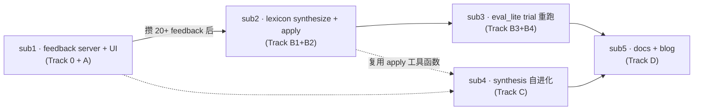

# Dogfood Feedback Loop v0 · 子 plan 索引

> **母 plan**：`~/.cursor/plans/dogfood-feedback-loop-v0_d9ffe369.plan.md`（背景与决策依据；workhorse 不必读）
>
> **核心反直觉**：风格 (taste) 是 a posteriori 涌现的——所以 P2 (feedback loop) 必须先做，P0 (eval harness) 等 lexicon 稳定后再做。颠倒顺序就是 garbage in garbage out。

---

## 依赖图



实线 = 强依赖（前者代码 / 数据是后者输入）；虚线 = 模式复用（可借鉴函数）

---

## 子 plan 一览

| 子 plan | 内容 | 工程量 | 何时启动 |
|---|---|---|---|
| [sub1-feedback-server-and-ui.md](sub1-feedback-server-and-ui.md) | 本地 http.server + POST 写 jsonl + inbox/index 打分表单 + Lessons 归档 | 1-2 天 | **立即** |
| [sub2-lexicon-synthesize-and-apply.md](sub2-lexicon-synthesize-and-apply.md) | flagship 模型读 jsonl 产 proposal → review UI → apply 落 lexicon 版本 bump | 2-3 天 | sub1 跑过、`feedback.jsonl` ≥ 20 行后 |
| [sub3-eval-lite-trial-rerun.md](sub3-eval-lite-trial-rerun.md) | 复用 `a.json` 重跑 b → trial diff UI tab → 单卡 / 整体 accept 隐式回写 feedback | 2 天 | sub2 完成、第一次 lexicon bump 后 |
| [sub4-synthesis-self-evolve.md](sub4-synthesis-self-evolve.md) | sub2 模式复制到 `raw-questions-synthesis.md` §2/§5/§6 自进化 | ✅ 已落地（2026-05-24） | `synthesize_user_memory` + Tab Synthesis Review |
| [sub5-docs-and-blog.md](sub5-docs-and-blog.md) | `dogfood-loop-design.md` 架构决策 + codemap §1 更新 + blog 大纲 | 0.5-1 天 | sub3 (至少跑过 1 轮 trial) 之后 |

---

## Workhorse 派发模板

每份子 plan 文件**自包含**——workhorse 不用回读母 plan / codemap / 其它子 plan 也能执行。派发方式：

### 方式 A：Cursor Task 工具（推荐）

```
Task(
  subagent_type="best-of-n-runner",   # 或 generalPurpose
  description="exec sub1 feedback server",
  prompt="""
读 agentflow3-tocode/dogfood-subplans/sub1-feedback-server-and-ui.md 并按其 §3 任务清单完成所有工作。
完成后报告：
1. 新建文件列表
2. 修改文件列表
3. 验收清单逐条 ✅/❌
4. 范围内未做的事 + 原因
"""
)
```

### 方式 B：人工开新 chat

新开一个 Cursor chat，把这份 README + 对应子 plan 文件 @ 进去，agent 模式跑。

---

## 关键约束（每个 workhorse 都要遵守）

1. **不动 `agents_runtime/orchestrate.py` 的 `STAGE_ORDER`**——feedback loop 与主链路完全解耦
2. **不改 `chains.json`**——trial 是只读观察工具
3. **`users/qihaoyu/` 路径已为未来 multi-user 留座**——本轮不实现 multi-user 切换，但代码不要硬编码 "qihaoyu"，从 env `IC_USER` 默认值读
4. **markdown 优先**——schema / 文档 / 模板都先以 md 形式表达；JSON / Python 只在确有运行时需要时才引入
5. **不引入 Flask / FastAPI 等额外依赖**——server 用 Python 3 stdlib `http.server` 即可（用户偏好简洁、低维护）
6. **中英混合可以，但回答 / 注释 / commit message 易于理解**——专有名词外尽量中文，避免黑话堆积（用户语言偏好；见 sub1 Track 0）

---

## 与现有 agentflow 的接合点

- **sub1 server** 启动后，inbox.html 应通过 `http://localhost:8765/inbox.html` 访问；原 `file://` 方式仍可工作但无打分功能
- **sub2 apply** 写新 lexicon 时，会顺手更新 `agent第二轮/pipeline-b-style.prompt.md` frontmatter 的 `source:` 引用 + `last_iter` 日期；下次 `agents_runtime.run_b` 自动读新版
- **sub3 eval_lite** 调用 `run_b` 时，要支持 `lexicon_path` override 参数（需小改 `agents_runtime/agents.py`，本子 plan 范围内可改）
- **sub4 apply** 写新 synthesis 时同理更新 `agent第二轮/pipeline-a-diagnose.prompt.md` frontmatter（如有版本字段）
- **不需要**改 `round2/` 任何文件、不需要改 `tools/export_v3_chains.py`、不需要改 `crystallization-prototype/chains.data.js` 生成逻辑

---

## 文件落点全景（执行完 5 个子 plan 后的预期布局）

```
growth/
├── tools/
│   ├── feedback_server.py            # sub1 新
│   └── start_feedback_server.sh      # sub1 新
├── users/                             # sub1 新（目录）
│   └── qihaoyu/
│       ├── feedback.jsonl            # sub1 写入；gitignored
│       ├── lexicon_proposals/        # sub2 写入
│       │   └── <ts>_proposal.md
│       └── synthesis_proposals/      # sub4 写入
│           └── <ts>_proposal.md
├── agents_runtime/
│   ├── synthesize_lexicon.py         # sub2 新
│   ├── synthesize_user_memory.py     # sub4 新
│   ├── eval_lite.py                  # sub3 新
│   └── _prompts/                     # sub2 / sub4 新（目录）
│       ├── synthesize-lexicon.prompt.md
│       └── synthesize-user-memory.prompt.md
├── crystallization-prototype/
│   ├── inbox.html / .js / .css       # sub1 改
│   ├── index.html / app.js / styles.css  # sub1 改
│   ├── lexicon_review.html / .js / .css  # sub2 新；sub3 加 tab
│   └── synthesis_review.html         # sub4 新（或复用 lexicon_review）
├── context/
│   ├── pipeline-b-style-lexicon-v1.md      # sub1 §1 微改；sub2 起 bump v2/v3
│   ├── pipeline-b-style-lexicon-v2.md      # sub2 第一次 apply 产
│   ├── raw-questions-synthesis.md          # sub4 起更新
│   └── _archive/                            # sub2 / sub4 写入
│       ├── lexicon-v1-2026-05-21.md
│       └── synthesis-2026-05-28.md
├── eval/
│   └── lexicon_trials/                # sub3 写入
│       └── v2/<run_id>/{b_old.json, b_new.json, diff.md}
│       └── v2/summary.md
├── runs/
│   └── _index.py / _index.js         # sub1 A4 改（feedback_summary 聚合）
├── agentflow3-tocode/
│   ├── codemap-agentflow.md          # sub5 改（§1 Phase 3 标注）
│   ├── dogfood-loop-design.md        # sub5 新
│   └── dogfood-subplans/             # ← 本目录
└── 外部source/
    └── blog-draft-l5-dogfood-loop.md # sub5 新（占位 + 大纲）
```

---

*创建日期：2026-05-21。母 plan 与本索引保持同步——任何子 plan 变化先改本文件再改母 plan。*
