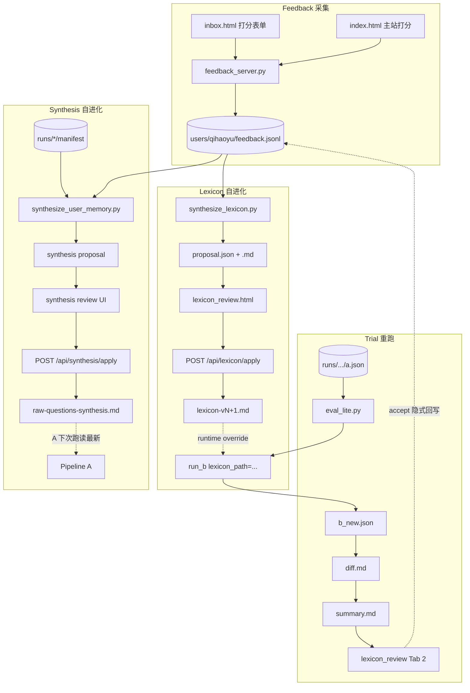

# Subplan 5 · 文档与 Blog 大纲（Track D）

> 母 plan：`~/.cursor/plans/dogfood-feedback-loop-v0_d9ffe369.plan.md`
> **前置**：sub1 + sub2 + sub3 至少各跑过 1 轮（有真实数据 / lexicon v2 / 至少 1 次 trial diff）；sub4 完成可选（若已做更好，blog 多一段证据）
> **后置**：blog 发布到 AI 社群（人工动作，不在本子 plan 范围）

---

## 0. 目标

把整套 dogfood loop 的**架构决策 + 数据契约 + 与 agentflow 接合点**写进一份新文档 `dogfood-loop-design.md`；同步更新 codemap 让别人能找到入口；写 blog 草稿大纲，等真实数据图（lexicon v1→v2 diff + judge 分变化）补上后发布。

**为什么不写完整 blog 而是大纲**：blog 的核心证据（"看，feedback loop 一轮后 anchor 字数中位数从 14 降到 9"）必须等 sub3 跑过 1-2 轮才有真数据；现在写完会变成空 think piece。先占位、攒证据、再补图。

---

## 1. 前置依赖

- sub1 已完成；`tools/feedback_server.py` + `users/qihaoyu/feedback.jsonl` 真实存在
- sub2 已完成；至少 1 次 lexicon apply 历史（有 v1→v2 的实际 diff 可截图）
- sub3 已完成；至少 1 次 trial 跑过（有 diff.md 可截图）
- sub4 可选（若有，blog 多一段 synthesis 同形演进的证据）
- `agentflow3-tocode/codemap-agentflow.md` 仍是当前进度的 SSOT

---

## 2. 必读上下文

| 文件 | 你为什么要读 |
|---|---|
| [agentflow3-tocode/codemap-agentflow.md](../../agentflow3-tocode/codemap-agentflow.md) | 当前 codemap §1 进度表是你要更新的入口 |
| 母 plan `~/.cursor/plans/dogfood-feedback-loop-v0_d9ffe369.plan.md` | 架构决策来源；dogfood-loop-design.md 要把母 plan 的「为什么不先做 eval」论证沉淀进来 |
| [agentflow3-tocode/phase3-eval-harness.md](../../agentflow3-tocode/phase3-eval-harness.md) | 原 Phase 3 计划文档；要在它的位置加一行「改为 dogfood loop, 见 dogfood-loop-design.md」（不删原文，留作 archive 参考）|
| [sub1-feedback-server-and-ui.md](sub1-feedback-server-and-ui.md) §4 | feedback.jsonl schema + server 路由表（dogfood-loop-design.md §2 数据契约要引用）|
| [sub2-lexicon-synthesize-and-apply.md](sub2-lexicon-synthesize-and-apply.md) §4 | proposal.json schema + patch action 枚举（design 文档要引用）|
| [sub3-eval-lite-trial-rerun.md](sub3-eval-lite-trial-rerun.md) §4 | trial 目录结构（design 要画一张全景图）|
| [外部source/产品.txt](../../外部source/产品.txt) | L3-L6 + 应用六层的原始文章；blog 引用框架时要准确引用 |
| 真实跑过的 `eval/lexicon_trials/v2/summary.md` | 提取数据点做 blog 数据图证据 |
| 真实 lexicon v1 与 v2 diff | 提取截图素材 |

---

## 3. 任务清单（覆盖母 plan todos: D1 / D2 / D3）

### 3.1 D1 · dogfood-loop-design.md

新建 [agentflow3-tocode/dogfood-loop-design.md](../../agentflow3-tocode/dogfood-loop-design.md)：

结构（每节给出 1-3 句要点；workhorse 自由扩展但不要偏离主旨）：

```markdown
# Dogfood Feedback Loop 架构决策（ADR）

> 决策日期：2026-05-21
> 决策者：用户 + agent
> 状态：已实施（sub1-sub4 已完成）
> 取代：[phase3-eval-harness.md](phase3-eval-harness.md) 的优先级 / 顺序（原 Phase 3 不取消，推迟）

## 0. 一句话决策

把「先做 eval」颠倒为「先建 feedback loop」——风格 (taste) 是 a posteriori 涌现的，所以采集信号比量化标准更先。

## 1. 决策背景

- 原 Phase 3 卡在「我自己都不知道 eval 标准」 → garbage in garbage out
- 真实风格信号目前只在用户脑子里 / 散在标注册手写备注里 → 没有结构化源
- L5 reliability 不一定要 regression test；可以是「每周看 propose-apply diff 闭环」

## 2. 三 Track 契约（数据流图 + JSON schema）

### 2.1 数据流全景图（mermaid）

（画一张：feedback.jsonl ↑← inbox/index UI / lexicon_review → synthesize_lexicon → proposal.json → apply → lexicon-vN+1.md → run_b override → eval/lexicon_trials → trial UI → 隐式 feedback 回写 → 下轮 synthesize）

### 2.2 feedback.jsonl line schema

（引用 sub1 §4.1，简化 1 表）

### 2.3 lexicon proposal.json schema

（引用 sub2 §3.1）

### 2.4 synthesis proposal.json schema

（引用 sub4 §3.2；标明与 lexicon 同形差异）

### 2.5 文件命名 / 归档约定

- `context/pipeline-b-style-lexicon-v<N>.md` 单调递增
- `context/_archive/lexicon-v<N>-<date>.md`
- `context/_archive/synthesis-<date>.md`
- `eval/lexicon_trials/v<N>/<run_id>/`
- `users/<uid>/{feedback.jsonl, lexicon_proposals/, synthesis_proposals/}`

## 3. server 路由表（feedback_server.py 完整版）

| Method | Path | 子 plan 来源 | 用途 |
|---|---|---|---|
| ... 完整路由表（合并 sub1/2/3/4 加的所有路由）|

## 4. 与现有 agentflow 的接合点

- 不动 `agents_runtime/orchestrate.py` 的 STAGE_ORDER（feedback loop 与主链解耦）
- 不动 `round2/*.py`（plumbing 不变）
- `agents_runtime/agents.py` run_b 仅加 `lexicon_path` 可选参数（向后兼容）
- `agent第二轮/pipeline-b-style.prompt.md` frontmatter 由 sub2 apply 自动改 source + last_iter
- `pipeline-a-diagnose.prompt.md` 不动（synthesis 路径不变）

## 5. 风险与缓解（合并母 plan 风险表 + 每子 plan §7 风险）

## 6. 退路 / 何时进真 Phase 3 eval

- 触发条件：lexicon 2-3 个版本后用户感觉「propose 没新东西可加 / 改动很小」→ 信号收敛 → 此时定义 eval baseline 才有意义
- 进入 Phase 3 时本 design 文档不废弃，作为 feedback 采集层永久存在

## 7. 度量（v0 期间手工跟踪）

- 周度：feedback.jsonl 行数增长曲线
- 每次 apply：lexicon char count delta / patch 采纳率
- 每次 trial：anchor 字数中位数 / mech 字数中位数 / 用户单卡 accept 率
- 大约 1-2 月：把这些做成 simple 图表，可作 blog 数据图

## Appendix A: 子 plan 索引

- [sub1-feedback-server-and-ui.md](dogfood-subplans/sub1-feedback-server-and-ui.md)
- [sub2-lexicon-synthesize-and-apply.md](dogfood-subplans/sub2-lexicon-synthesize-and-apply.md)
- [sub3-eval-lite-trial-rerun.md](dogfood-subplans/sub3-eval-lite-trial-rerun.md)
- [sub4-synthesis-self-evolve.md](dogfood-subplans/sub4-synthesis-self-evolve.md)

## Appendix B: 历史 phase3-eval-harness.md 的关系

phase3-eval-harness.md 原计划仍归档保留，作为「lexicon 收敛后下一步」的施工蓝图。本 design 文档与它**互补**：本文档管「涌现期」，phase3 文档管「固化期」。
```

### 3.2 D2 · codemap §1 进度表更新

修改 [agentflow3-tocode/codemap-agentflow.md](../../agentflow3-tocode/codemap-agentflow.md) §1：

把 Phase 3 那行：

```
| **3** eval harness | [phase3-eval-harness.md](./phase3-eval-harness.md) | （应有 `agents_runtime/eval.py` + `eval/suites/`） | **未做** | 改 prompt 后仍靠人工对比 JSON |
```

改成：

```
| **3** eval harness | [phase3-eval-harness.md](./phase3-eval-harness.md)（推迟）→ [dogfood-loop-design.md](./dogfood-loop-design.md)（替代） | `agents_runtime/{synthesize_lexicon,synthesize_user_memory,eval_lite}.py` + `tools/feedback_server.py` + `crystallization-prototype/lexicon_review.html` | **已落地（feedback loop 形态）** | 详见 [dogfood-subplans/README.md](./dogfood-subplans/README.md) |
```

同时在 §1 表下面的「额外工程」表里追加一行：

```
| Dogfood Feedback Loop | `tools/feedback_server.py` + `users/qihaoyu/` + `agents_runtime/synthesize_*.py` | 让 taste 涌现成可量化标准；详见 [dogfood-loop-design.md](./dogfood-loop-design.md) |
```

### 3.3 D3 · blog 草稿大纲

新建 [外部source/blog-draft-l5-dogfood-loop.md](../../外部source/blog-draft-l5-dogfood-loop.md)：

> 注：放 `外部source/` 而不是 `agentflow3-tocode/` 是因为 blog 偏个人对外输出，与项目设计文档分层放。

大纲结构：

```markdown
# 标题候选（任选 / 优化）

- L4.5 到 L5 之间：当「好」本身还在涌现，怎么做 evaluation？
- 我把 AI workflow 的 eval 颠倒了：先 feedback loop，再量化
- 为什么我没做 LLM eval harness，先做了一个浏览器打分按钮

> 目标读者：AI 社群里在做 personal AI / LLM workflow 的人；已读过产品文 §三 六层 / §四 L3-L6 框架。

---

## TL;DR（3 句）

- 我的项目是 inquiry chain crystallization——把心理对话转写成「机制+短锚+小动作」三层晶体卡
- 按产品分层框架，它落在 LLM Workflow (L4 上沿)；我个人能力在 L5 中段
- 卡在哪：「**风格 (taste) 还在涌现，eval 标准定义不出**」——我用 dogfood feedback loop 替代了 Phase 3 eval harness，让 lexicon 自己进化

## §1 项目快照（300 字 + 一张架构图）

- 5 个 stage：route_helper → A → B → judge → push
- 两个 SSOT：B 的 lexicon（风格规则）/ A 的 synthesis（用户记忆）
- 主链路完全可跑（codemap 截图）

## §2 卡点：为什么没有第一时间做 eval

- 「routing 任务（new/update/meta + axis）任何 AI 都能做」
- 「真正的难是语言风格——但我自己都不知道我喜欢的是哪些」
- garbage in garbage out 论证

## §3 反直觉决策：先 feedback loop，后 eval

- 第一性原理：taste = a posteriori 涌现
- 三 track 设计：feedback / lexicon 自进化 / synthesis 自进化
- (放 dogfood-loop-design.md §2.1 数据流全景图)

## §4 实施细节：5 个子 plan + workhorse 派发

- 子 plan 索引 + workhorse Task 工具用法（让别的开发者借鉴拆分手法）
- 关键约束：不动 orchestrate STAGE_ORDER；feedback loop 与主链解耦

## §5 真实数据（待 sub3 跑过 1-2 轮后补）

- (TODO 数据图 1)：feedback.jsonl 行数 / 周度增长曲线
- (TODO 数据图 2)：lexicon v1 → v2 diff 截图 + patch 采纳率
- (TODO 数据图 3)：trial 5 张卡 anchor 字数中位数变化
- (TODO 数据图 4)：第一次 trial accept 后 lexicon v2 → v3 diff 与上轮的关系（信号收敛证据）

## §6 反思：什么时候才进真 Phase 3 eval

- 信号收敛指标：连续 2 个 lexicon propose patch 数 < 3 → 该建 baseline 了
- 那时 dogfood loop 不废弃，作 feedback 采集层永存

## §7 你能用这套思路做什么

- 任何 personal AI workflow（写作辅助 / 个性化助理 / 内容生成）都适用
- 关键是把 SSOT 拆成「不变骨架（schema）」 + 「可变风格层（lexicon）」
- 风格层永远 per-user；骨架可全局共享

## §8 接下来想做什么

- per-user 风格旋钮（multi-user 切换）
- proactive trigger（cron 监测 外部source/ 新对话自动 orchestrate）
- 真 Phase 3 eval harness（lexicon 收敛后）

## 致谢 / 参考

- Anthropic Building Effective Agents
- OpenAI A Practical Guide to Building Agents
- Google Cloud agent design pattern
- 引用产品文 §三 §四（注明出处）

---

**发稿前 checklist（占位待办）**：

- [ ] 等 sub3 跑过 1-2 轮，补 §5 4 张数据图
- [ ] 脱敏（外部source/ 里若 blog 截图涉及私人对话要打码）
- [ ] 标注「这是 personal tool，开源是方法论 / 非 SaaS」
- [ ] 校对一遍按 .cursorrules 「中英混合 + 易于理解 + 专有名词外用中文」
```

---

## 4. 输入 / 输出契约

本子 plan 全是 markdown 文档；无运行时契约。**3 个新增 md 文件**：

- `agentflow3-tocode/dogfood-loop-design.md`
- `外部source/blog-draft-l5-dogfood-loop.md`
- （只是修改）`agentflow3-tocode/codemap-agentflow.md`

---

## 5. 验收清单

- [ ] `dogfood-loop-design.md` 7 节 + 2 个 Appendix 都写齐
- [ ] §2.1 数据流全景图用 mermaid 画得通（在 Cursor 渲染器里能看到图）
- [ ] §3 server 路由表合并了 sub1/2/3/4 加过的所有路由（去重 + 标 source）
- [ ] 引用 sub1/2/3/4 §4 schema 时使用 markdown link 跳转
- [ ] codemap §1 Phase 3 行已更新 + 「额外工程」表已加 dogfood loop 行
- [ ] phase3-eval-harness.md 文件**不动**（archive 保留），只在 codemap 链接旁标「推迟」+ 指向 dogfood-loop-design.md
- [ ] blog 大纲 8 节 + 致谢区都写齐
- [ ] blog §5 真实数据 4 张图标 TODO 占位（不假装已有数据）
- [ ] blog 末尾「发稿前 checklist」存在
- [ ] 所有 3 个新增 md 通过 `.cursorrules` 「中英混合 + 易于理解 + 专有名词外中文」自查
- [ ] mermaid 节点名用 camelCase / 下划线（不用空格）；标签含括号或冒号时用双引号

---

## 6. 范围边界（绝对不做）

- ❌ **不**真发 blog（人工动作；本子 plan 只到大纲）
- ❌ **不**做数据图（等 sub3 真实数据；硬 mock 图就是 garbage in）
- ❌ **不**删 phase3-eval-harness.md（archive 价值大于删除）
- ❌ **不**重写 codemap 全文（只精改 §1 表与「额外工程」一行）
- ❌ **不**改任何代码或 prompt
- ❌ **不**发起 git commit / push（除非用户明确要求）

---

## 7. 风险与缓解

| 风险 | 缓解 |
|---|---|
| dogfood-loop-design.md 与子 plan 内容重叠多 | 设计文档**引用** 子 plan，不复制内容；用 markdown link |
| codemap 改动破坏 §1 表格 markdown 渲染 | 改前复制原表格到 staging，确保管道符对齐 |
| mermaid 数据流图节点太多渲染挤 | 用 subgraph 分组（feedback / lexicon / synthesis 三栏）|
| blog §1-4 写太长、§5 数据缺位看起来空 | 大纲阶段每节明确字数预算；§5 留醒目 TODO 块 |
| 用户后续要发布时发现 blog 大纲与最新代码 desync | design 文档作 SSOT；blog 发布前再 sync 一次 |

---

## 8. 实施建议

1. **先 dogfood-loop-design.md 骨架**（7 节标题 + 每节 1 句要点 + Appendix）
2. **填 §2 数据契约**（直接 markdown link 子 plan §4，避免复制）
3. **填 §3 路由表**（grep sub1/2/3/4 的「server 路由表」节，合并到一张表）
4. **画 §2.1 mermaid 全景图**（最花时间；先用纸笔画一遍再写 mermaid）
5. **改 codemap**（最小改动；改完肉眼看渲染对不对）
6. **写 blog 大纲**（最后；每节占位 + TODO 数据图标注）

### 关键代码线索

**mermaid 全景图节点建议**：



（仅参考，workhorse 实施时可微调节点数减少视觉拥挤）

---

## 9. workhorse 完成后回报模板

参见 sub1 §9。本子 plan 额外强调：报告里贴 codemap §1 改后的最终 markdown 文本（让用户一眼确认表格对齐没破坏）；贴 mermaid 图在 Cursor 渲染器里的截图（如不便截图，至少把 mermaid 源码完整贴报告）。
