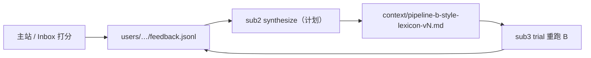

# Dogfood 反馈闭环 · 产出索引

> **状态摘要（2026-05-23）**：sub1 打分 + 开发台已落地；lexicon **v2** 已手工收敛并 dogfood 重跑 2 卡；`users/qihaoyu/feedback.jsonl` 已有 **20 行**真实反馈。sub2/sub3 的 **自动化 UI**（`synthesize_lexicon` / `eval_lite` / `lexicon_review.html`）见子 plan，当前 trial 产物在 `eval/lexicon_v2_dogfood/`。

---

## 1. 这条链路在干什么（30 秒）

**第一性原理**：口味是事后涌现的——先攒「喜不喜欢」信号，再改 lexicon，再用同一批 `a.json` 重跑 B 看 diff，而不是先造 eval 再猜规则。

---

## 2. 日常怎么用（必读）

| 动作 | 命令 / URL |
|------|------------|
| **一键开开发台** | 仓库根：`bash tools/start_dev_ui.sh` |
| 开发台导航 | `http://127.0.0.1:8765/dev-hub.html` |
| **主站打分**（已入库卡） | `/index.html` → 展开卡 →「打分 / 感受」 |
| **Inbox 打分**（待审 run） | `/inbox.html` |
| Context 审阅 | `/context-curator/` |
| 刷新 inbox 列表 | `./venv/bin/python3 runs/_index.py` 后刷新页 |

打分 **必须**走 HTTP 同源（开发台）；`file://` 只能看卡，不能 POST feedback。

---

## 3. 反馈数据放在哪

| 项 | 路径 / 说明 |
|----|-------------|
| **主文件** | `users/qihaoyu/feedback.jsonl`（一行一条 JSON，UTF-8） |
| 用户 ID | 环境变量 `IC_USER`，默认 `qihaoyu` |
| Git | `users/.gitignore` 忽略 `*/feedback.jsonl` — **不进公开 repo** |
| 聚合索引 | `runs/_index.py` 读 jsonl → `window.FEEDBACK_SUMMARY`（卡顶「已 N 条」徽标） |
| 健康检查 | `GET /api/health` → `total_lines`、`jsonl_path` |

### 一行 feedback 长什么样

| 字段 | 含义 |
|------|------|
| `target_type` | `card`（主站 IC-NNN）/ `run`（inbox run_id）/ `trial`（sub3 计划，trial accept 回写） |
| `target_id` | 如 `IC-024`、`sample_fixture_conditional_pass` |
| `stage_focus` | `card` → `merged`；`run` / `trial` → `b` |
| `scores` | mechanism / anchor / micro_steps / overall（1–5 或 null） |
| `freeform` | 自由感受（**最有价值**，sub2 synthesize 主要读这个） |
| `tags` | `stylewin` / `stylelose` / `lexicon-cand` / `synthesis-cand` |
| `lexicon_hypothesis` | 可选：猜 lexicon 该怎么改 |

当前本机约 **20 行**，以 `target_type=card`、主站逐卡 dogfood 为主（IC-001–IC-026 等）。

---

## 4. 子 plan 与仓库里实际有什么

| 子 plan | 计划交付 | 当前仓库 |
|---------|----------|----------|
| **sub1** | `feedback_server` + 打分表单 | ✅ `tools/feedback_server.py`、`feedback-form.js`、`dev-hub.html` |
| **sub2** | jsonl → proposal → apply → lexicon vN+1 | ⚠️ **v2 已手工落档**（见下）；`synthesize_lexicon` / review UI 未代码化 |
| **sub3** | `eval_lite` + trial diff UI | ⚠️ **手动 trial** 见 `eval/lexicon_v2_dogfood/`；自动化 CLI/UI 见 sub3 plan |
| sub4 / sub5 | synthesis 自进化、架构文档 | 未做 |

### Lexicon v2（sub2 的实质产出）

| 文件 | 说明 |
|------|------|
| `context/pipeline-b-style-lexicon-v2.md` | Pipeline B **唯一**风格 SSOT（prompt `inputs.style_lexicon` 已指向此文件） |
| `context/_archive/lexicon-v1-2026-05-22.md` | v1 归档 |
| `agentflow3-tocode/_done/lexicon-v2-merge-proposal.md` | 手工合并决策记录（ratified） |

### Trial 重跑（sub3 的实质产出）

| 路径 | 说明 |
|------|------|
| `eval/lexicon_v2_dogfood/SUMMARY.md` | v2.2 vs v2.3（lexicon v2）同 `a.json` 重跑 B 的并排对比 |
| `eval/lexicon_v2_dogfood/球场垃圾话_update/` | update 分支：`b_v23.json` 等 |
| `eval/lexicon_v2_dogfood/觉醒_meta/` | meta 分支 |

**做法**：复用历史 `a.json`，用新 lexicon 只重跑 B，人读 diff——不是自动评分 harness。

sub3 **计划**目录形态：`eval/lexicon_trials/v<N>/<run_id>/{b_old,b_new,diff.md}` + `lexicon_review.html` Tab 2；落地后 trial accept 会隐式写 `target_type=trial` + tag `lexicon-vN-win/lose`。

---

## 5. 与其它 UI 的分工

| 页面 | 何时用 |
|------|--------|
| **主站** | 已入库卡：trigger 检索 + **打分** + 笔记 |
| **Inbox** | `awaiting_human` run：Judge 分数、accept/reject **复制命令**（不自动 merge）+ 打分 |
| **Context 审阅器** | 看 A/B/Judge **上下文装配**，不打分、不改 lexicon |

Inbox accept 命令（复制到终端）：`python -m agents_runtime.orchestrate --resume <run_id> --from push [--force-pass]` — 与打分 **独立**；打分不会触发入库。

---

## 6. 下一步（按子 plan 顺序）

1. **sub2 自动化**：`feedback.jsonl`（≥20 行已满足）→ `synthesize_lexicon` → 人审 proposal → bump v3
2. **sub3 自动化**：`eval_lite.py` 批量重跑 → UI diff → accept 回写 jsonl
3. 主站 / trial 新反馈 → 下一轮 synthesize 燃料

---

## 7. 相关文档（按需深读）

| 文档 | 内容 |
|------|------|
| [dogfood-subplans/README.md](../dogfood-subplans/README.md) | 子 plan 依赖图 |
| [sub1-feedback-server-and-ui.md](../dogfood-subplans/sub1-feedback-server-and-ui.md) | feedback schema + server 路由 |
| [sub3-eval-lite-trial-rerun.md](../dogfood-subplans/sub3-eval-lite-trial-rerun.md) | trial 目录契约 + API 设计 |
| [_done/lexicon-v2-merge-proposal.md](../_done/lexicon-v2-merge-proposal.md) | v2 手工合并全过程 |
