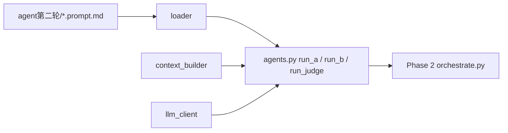

# Plan：Phase 1 — prompt → callable（loader + llm_client + context_builder + agents）

> **触发源**：[`plan-chat-to-code-api.md`](plan-chat-to-code-api.md) §5.1。
> **状态**：待实施。
> **预计交付**：单次 workhorse session（1 天专注开发 + 0.5 天回归）。
> **本 plan 的标准**：workhorse agent 仅读本 plan + §2 必读列表，即可独立完成 Phase 1 全部代码与单测，**不需要回看 master plan**。
>
> **第一性原理**：把 4 份 md prompt（A / B / Judge / push）包装成 Python 函数 `run_*(inputs) -> dict`。chat 模式下的"人手 @ 文件 + 复制 stdout"由 py 在 runtime 静默装配；prompt 本身**字面不动**（md 是契约真理）；LLM 调用走 DeepSeek API；JSON 输出由 `response_format` 强制 + 客户端 retry 保底。

---

## 0. 模块定位

Phase 1 是 code+api 链路的最底层"算子"。Phase 2 的 orchestrator 把这些算子串成完整链路；Phase 3 / 4 / 5 都依赖 Phase 1 的函数签名稳定。



**单一职责**：把 prompt md 变成"输入 dict → 输出 dict"的纯函数。**不做**编排、不写状态文件、不调 round2 plumbing、不渲染 UI。

---

## 1. 验收标准（可测试 checklist）

- [ ] `python -m agents_runtime.agents run_a 外部source/球场垃圾话应对策略.md` 在终端跑出 A draft JSON
- [ ] 上一条产物与黄金对照 [`agents/runs/run_2026-05-11_pipeline-a_ball-trash-talk.json`](agents/runs/run_2026-05-11_pipeline-a_ball-trash-talk.json) 逐字段对比：`axis` / `route` / `patterns`（作集合比较）一致；`mechanism_sketch` 措辞可不同但语义同向
- [ ] `python -m agents_runtime.agents run_b <a_output.json>` 在终端跑出 B card / update_entry JSON；对照 [`agents/runs/run_2026-05-12_pipeline-b_ball-trash-talk.json`](agents/runs/run_2026-05-12_pipeline-b_ball-trash-talk.json)
- [ ] `python -m agents_runtime.agents run_judge <b_output.json> <route_context.json>` 跑出 judge_report；对照 [`agents/runs/run_2026-05-12_judge_ball-trash-talk.json`](agents/runs/run_2026-05-12_judge_ball-trash-talk.json)，6 维度 scores 整体方向一致（±0.5 容差）
- [ ] `forbidden_inputs` 在 py 里实施为 lint：`context_builder.build()` 若被要求从 forbidden 列出的文件读内容 → 抛 `ForbiddenInputError`，附违反的字段名 + 文件路径
- [ ] DeepSeek API 调用：A / Judge 用 `model=DEEPSEEK_REASONING_MODEL` + `temperature=0`；B 用 `model=DEEPSEEK_CHAT_MODEL` + `temperature=0.3`；全部使用 `response_format={"type": "json_object"}`
- [ ] llm_client retry：JSON parse 失败时 retry 1 次（原 prompt 末尾加一句 `"上一次返回不是合法 JSON，请只输出合法 JSON object"`）；仍失败 → 抛 `LLMJsonParseError` 并把 raw text 写到 `runs/<run_id>/_debug/parse_fail_<ts>.txt`（**runs/ 目录暂未存在 — 若调用方未指定 debug_dir，fallback 到当前工作目录 `./_debug/`**）
- [ ] JSON parse fail 率统计：每次调用后 append 一行到 `agents_runtime/_stats/parse_stats.jsonl`（`{ts, agent, success, retried}`），便于 Phase 1 末日计算 fail 率
- [ ] 单测：`agents_runtime/tests/{test_loader,test_context_builder,test_llm_client_mock}.py` 全部 pass（pytest）

---

## 2. 必读输入（context curation — workhorse MUST read 全文 / 指定章节）

| 路径 | 读哪部分 | 用途 |
|---|---|---|
| 本 plan（[phase1-prompt-callable.plan.md](agentflow3-tocode/phase1-prompt-callable.plan.md)） | 全文 | 实施依据 |
| [agent第二轮/pipeline-a-diagnose.prompt.md](agent第二轮/pipeline-a-diagnose.prompt.md) | **frontmatter 全部** + body 前 3 节（角色 / 任务 / 输入契约） | 抽 inputs/outputs schema + forbidden_inputs；body 装载机制 |
| [agent第二轮/pipeline-b-style.prompt.md](agent第二轮/pipeline-b-style.prompt.md) | 同上 | 同上 |
| [agent第二轮/judge.prompt.md](agent第二轮/judge.prompt.md) | 同上 | 同上 |
| [agent第二轮/conventions.md](agent第二轮/conventions.md) | 全文 | 理解 frontmatter 必备字段语义 / forbidden_inputs 纪律 |
| [tools/llm_api.py](tools/llm_api.py) | `create_llm_client()`（68-行附近）+ `deepseek` 分支（85-91 行） | DeepSeek client 构造方式；base_url `https://api.deepseek.com/v1`；env `DEEPSEEK_API_KEY` |
| [agents/runs/run_2026-05-11_pipeline-a_ball-trash-talk.json](agents/runs/run_2026-05-11_pipeline-a_ball-trash-talk.json) | 全文 | A 黄金对照基准 |
| [agents/runs/run_2026-05-12_pipeline-b_ball-trash-talk.json](agents/runs/run_2026-05-12_pipeline-b_ball-trash-talk.json) | 全文 | B 黄金对照基准 |
| [agents/runs/run_2026-05-12_judge_ball-trash-talk.json](agents/runs/run_2026-05-12_judge_ball-trash-talk.json) | 全文 | Judge 黄金对照基准 |
| 调 prompt 时引用的 6 份 doc（运行时按 frontmatter `inputs[].source` 动态读，不在编码期通读） | 见各 prompt 的 frontmatter | 装配 user message |

---

## 3. 禁读列表（context curation — workhorse MUST NOT read）

| 路径 | 为什么不读 |
|---|---|
| `外部source/*.md`（除 `球场垃圾话应对策略.md` 作 fixture 路径出现在测试） | 你不写 prompt、不做诊断；question_md 内容在 runtime 才被 context_builder 读 |
| `回答版本explore/*.md` | 同上；这是 B / Judge 在 runtime 才读的 rubric |
| `context/*.md`（schema / brief / synthesis） | 同上；runtime 才装配 |
| `inquiry-chain-demo-v3-good-answer.md` | 同上；retrieval 期才读（Phase 5），编码期不需要 |
| `data/chains.json` | Phase 2 才需要（route=update 时取 existing_card）；Phase 1 不动 |
| `round2/run_pipeline.py` / `round2/route_helper.py` | Phase 2 才需要；Phase 1 不调用 round2 |
| `crystallization-prototype/*` | Phase 4 才需要 |
| [agentflow3-tocode/plan-chat-to-code-api.md](agentflow3-tocode/plan-chat-to-code-api.md) **master plan** | **本 plan 已抽出全部 Phase 1 必要信息**；读 master 会 attention 稀释到 Phase 2-5 内容 |
| [agentflow3-tocode/phase2-*.plan.md](agentflow3-tocode/phase2-orchestrator.plan.md) 等其他 phase plan | 你只做 Phase 1；下游 phase 怎么用你不操心，按 §8 接口契约交付即可 |
| `agent第二轮/push.prompt.md` | push 是 plumbing，不走 LLM，本 phase 不 wrap |
| `agent第二轮/plan-update-append-mode.md` | 正交工程，与 Phase 1 实现无关 |

---

## 4. 交付物清单

### 4.1 新增文件

| 路径 | 行数预估 | 单一职责 |
|---|---|---|
| `agents_runtime/__init__.py` | 5 | 包标识 + 暴露 `run_a` / `run_b` / `run_judge` |
| `agents_runtime/loader.py` | 80-120 | 解析 md prompt 的 frontmatter + body；返回 `Prompt` dataclass |
| `agents_runtime/context_builder.py` | 100-150 | 按 prompt.frontmatter.inputs 装配 user message；实施 forbidden_inputs lint |
| `agents_runtime/llm_client.py` | 80-120 | 直接调 DeepSeek（OpenAI 兼容 SDK）；retry + JSON parse + stats |
| `agents_runtime/agents.py` | 120-180 | `run_a` / `run_b` / `run_judge` 薄壳 + CLI（`python -m agents_runtime.agents <fn> <args>`） |
| `agents_runtime/errors.py` | 30 | `ForbiddenInputError` / `LLMJsonParseError` / `PromptLoadError` |
| `agents_runtime/tests/__init__.py` | 1 | — |
| `agents_runtime/tests/test_loader.py` | 60-100 | 解析 frontmatter + body 切分 |
| `agents_runtime/tests/test_context_builder.py` | 80-120 | forbidden_inputs lint + 字段装配 |
| `agents_runtime/tests/test_llm_client_mock.py` | 60-100 | mock OpenAI client；测 retry / parse / stats 写入 |
| `agents_runtime/tests/fixtures/mini.prompt.md` | 20 | 极简 prompt 用于 loader 测试 |

### 4.2 修改文件

- **无**。Phase 1 不动任何现有文件（包括 prompt md / .cursorrules / README）。

### 4.3 新增 / 修改的 .env 配置（**workhorse 不直接改用户 .env**，但要在 README 或代码注释里写明需求）

```bash
# 必填
DEEPSEEK_API_KEY=sk-...

# 可选（缺省时 fallback 到 deepseek-chat / deepseek-reasoner；模型 slug 升级时只改这里）
DEEPSEEK_REASONING_MODEL=deepseek-reasoner          # A / Judge 用；fallback 默认值
DEEPSEEK_CHAT_MODEL=deepseek-chat                   # B 用；fallback 默认值
```

`tools/llm_api.py` 已有 `DEEPSEEK_API_KEY` 加载逻辑（`load_environment()` 读 .env / .env.local），llm_client.py 复用同一 `load_environment()`（import 即可）。

---

## 5. 实现要点（API spec / 数据流）

### 5.1 loader.py

```python
from dataclasses import dataclass
import yaml

@dataclass
class Prompt:
    agent_id: str
    version: str
    model_tier: str                  # flagship / normal / plumbing
    inputs: list[dict]               # 原始 frontmatter inputs 列表
    outputs: list[dict]              # 同上 outputs
    forbidden_inputs: list[str]
    single_responsibility: str
    body: str                        # frontmatter --- 之后到文件末
    source_path: str                 # 原 md 路径（debug 用）

def load_prompt(name: str, *, prompts_dir: str = "agent第二轮") -> Prompt:
    """name = 'pipeline-a-diagnose'（不带 .prompt.md 后缀）"""
    path = f"{prompts_dir}/{name}.prompt.md"
    text = open(path, encoding="utf-8").read()
    # 解析 --- YAML --- + body；YAML 解析用 yaml.safe_load
    # 校验必备字段：agent_id / version / model_tier / inputs / outputs / forbidden_inputs / single_responsibility
    # 若 frontmatter 含未知字段：仅 warn 不 fail（前向兼容；conventions 加新字段不破 loader）
```

**边界 case**：
- frontmatter 含中文键 → yaml.safe_load 直接处理，UTF-8 文件读没问题
- body 含三引号 ``` 代码块 → 不做特殊处理，整段当 system prompt
- 文件不存在 / frontmatter 缺必备字段 → 抛 `PromptLoadError`

### 5.2 context_builder.py

```python
from .errors import ForbiddenInputError
from .loader import Prompt

# 注册表：frontmatter inputs[].name → "怎么从 inputs dict / 文件系统取数据"
# Phase 1 只实现 A/B/Judge 用到的 input name；以后加字段时往这里加映射
_INPUT_RESOLVERS = {
    # name: (resolver_fn, expects_kw_from_caller_or_path)
    "question_md":            "from_file",        # 调 build_context(inputs={"question_md": "<path>"})
    "route_helper_output":    "from_dict",        # build_context(inputs={"route_helper_output": {...}})
    "pipeline_a_draft":       "from_dict",
    "b_output":               "from_dict",
    "route_context":          "from_dict",
    "existing_card_json":     "from_dict",
    "style_brief":            "from_md_sections", # 按 source + sections frontmatter 切 md
    "annot_register":         "from_md_sections",
    "schema_lint":            "from_md_sections",
    "rubric":                 "from_md_sections",
    "v3_anchor":              "from_caller_list",  # fewshot 卡，调用方直接传字符串列表
    "raw_questions_synthesis": "from_md_sections",
}

def build_context(prompt: Prompt, inputs: dict) -> str:
    """
    按 prompt.inputs 顺序，把每个 input 拼成一段：
    # <input.name>
    <内容>
    返回完整 user message 字符串。

    forbidden_inputs lint：若 inputs[name] 指向的文件路径匹配 prompt.forbidden_inputs 任一 glob，抛 ForbiddenInputError。
    """
```

**glob 匹配**：用 `fnmatch.fnmatch`；`forbidden_inputs` 字符串是 glob，例如 `"外部source/*.md"`、`"context/inquiry-compound-vision.md / raw-questions-synthesis.md"`（含 `/` 的句子是人写的描述，**只取**括号外或斜杠分隔的第一个 token 做 glob——见下面"边界 case"）。

**边界 case**：
- forbidden_inputs 条目是人写的 markdown 字符串（含括号注释 / 中文 / 句号）。**实现**：把每条字符串 strip + split(" ") + 取每个 token 跟 `pathlib.Path(<inputs 来源路径>).as_posix()` 做 fnmatch；任一命中即 fail。
- `from_md_sections`：frontmatter 的 input 长这样 `{name: schema_lint, type: doc_section_set, source: "context/crystallization-schema-v0.md", sections: ["§4 内容 lint", "§6 反例"]}`。实现：读 source 文件，找 `## §4`、`## §6` 这样的 markdown heading（精确按 § 数字匹配，宽容 `## §4 内容 lint` 也匹配 `§4`），抽这段到下一个同级 heading 之前的内容。
- 找不到指定 section → 抛 `PromptLoadError`（heading 名拼错或文档结构变了，需要人去对齐 prompt frontmatter 与 doc）

### 5.3 llm_client.py

```python
import json, time, sys
from pathlib import Path
from openai import OpenAI
import os

from .errors import LLMJsonParseError

# 复用 tools/llm_api.py 的 load_environment 加载 DeepSeek key
_TOOLS = Path(__file__).resolve().parent.parent / "tools"
sys.path.insert(0, str(_TOOLS))
from llm_api import load_environment  # noqa: E402
load_environment()

_DEFAULT_REASONING = os.getenv("DEEPSEEK_REASONING_MODEL", "deepseek-reasoner")
_DEFAULT_CHAT      = os.getenv("DEEPSEEK_CHAT_MODEL",      "deepseek-chat")

def _get_client() -> OpenAI:
    return OpenAI(api_key=os.getenv("DEEPSEEK_API_KEY"), base_url="https://api.deepseek.com/v1")

def call_json(
    *,
    system: str,
    user: str,
    model: str,
    temperature: float,
    agent_id: str,                          # 仅用于 stats / debug 文件名
    debug_dir: str | None = None,
) -> dict:
    """
    调 DeepSeek chat.completions.create + response_format={"type": "json_object"}。
    JSON 解析失败 → retry 1 次（user 末尾加"请只输出合法 JSON object"）；仍失败 → 抛 LLMJsonParseError。
    """
    # 实现细节：
    # 1. 调用前 ts0 = time.time()
    # 2. resp = client.chat.completions.create(
    #        model=model,
    #        messages=[{"role": "system", "content": system}, {"role": "user", "content": user}],
    #        temperature=temperature,
    #        response_format={"type": "json_object"},
    #    )
    # 3. raw = resp.choices[0].message.content
    # 4. try json.loads(raw); 失败 → user += "\n\n【系统】上一次返回不是合法 JSON，请只输出一个合法 JSON object，不要 markdown fence" → 再 call 一次
    # 5. 失败两次 → 把 raw 写到 (debug_dir or "./_debug")/parse_fail_<agent_id>_<ts>.txt → raise
    # 6. 成功 → _append_stats(agent_id, success=True, retried=N)
    # 7. 返回 parsed dict
```

**模型档位选择规则**（agents.py 层而非 llm_client 层做映射，保持 llm_client 通用）：
- `run_a`：`model=_DEFAULT_REASONING, temperature=0`
- `run_b`：`model=_DEFAULT_CHAT, temperature=0.3`
- `run_judge`：`model=_DEFAULT_REASONING, temperature=0`

**注意（与 master plan §6.2 拍板理由对应）**：B 与 Judge 的 temperature 差异 + 档位差异，是 evaluator 共谋风险的两条物理缓解。**不要**为了"统一"把 Judge 调成 temperature=0.3，否则失去缓解效果。

### 5.4 agents.py

```python
from .loader import load_prompt
from .context_builder import build_context
from .llm_client import call_json, _DEFAULT_REASONING, _DEFAULT_CHAT

def run_a(question_md_path: str, *, route_helper_output: dict | None = None,
          fewshot: list[str] | None = None, debug_dir: str | None = None) -> dict:
    prompt = load_prompt("pipeline-a-diagnose")
    inputs = {
        "question_md": question_md_path,
        "route_helper_output": route_helper_output or {},
        "raw_questions_synthesis": None,    # context_builder 自己按 frontmatter 装
        "schema_lint": None,
        "v3_anchor": fewshot or [],
    }
    user = build_context(prompt, inputs)
    return call_json(
        system=prompt.body,
        user=user,
        model=_DEFAULT_REASONING,
        temperature=0.0,
        agent_id="pipeline-a-diagnose",
        debug_dir=debug_dir,
    )

def run_b(a_output: dict, *, existing_card: dict | None = None,
          fewshot: list[str] | None = None, debug_dir: str | None = None) -> dict:
    # 同构

def run_judge(b_output: dict, route_context: dict, *, existing_card: dict | None = None,
              fewshot: list[str] | None = None, debug_dir: str | None = None) -> dict:
    # 同构

# CLI 入口：python -m agents_runtime.agents <fn_name> <pos_args...>
def _cli():
    import sys, json
    fn_name, *args = sys.argv[1:]
    fn = {"run_a": run_a, "run_b": run_b, "run_judge": run_judge}[fn_name]
    if fn_name in ("run_b", "run_judge"):
        args = [json.loads(open(p).read()) for p in args]
    result = fn(*args)
    print(json.dumps(result, ensure_ascii=False, indent=2))

if __name__ == "__main__":
    _cli()
```

### 5.5 测试设计要点

`test_llm_client_mock.py`：用 `unittest.mock.patch("agents_runtime.llm_client._get_client")` 注入假 client，模拟 3 种返回：(a) 一次成功合法 JSON、(b) 第一次返回 `"hello"` 第二次合法 JSON、(c) 两次都非法。验证 retry 行为 + stats 文件追加 + 抛错。

`test_context_builder.py`：用 fixtures/mini.prompt.md（forbidden_inputs 含 `"外部source/*.md"`）；调 build_context 传 `inputs={"question_md": "外部source/x.md"}` → 应抛 ForbiddenInputError。

`test_loader.py`：解析 fixtures/mini.prompt.md 拿到 Prompt dataclass；检查 body 不含 frontmatter `---`；frontmatter 必备字段缺一即抛 PromptLoadError。

---

## 6. 不在范围（防止 workhorse 顺手做）

- ❌ **不写 orchestrate.py**（Phase 2）；run_a/run_b/run_judge 是各自独立的；本 phase 不串它们成链
- ❌ **不写 retrieval.py**（Phase 5）；fewshot 在本 phase 是调用方手传的字符串列表
- ❌ **不调 round2 任何 py**（Phase 2 才需要）
- ❌ **不动 push.prompt.md / 任何 prompt md 字面内容**（prompt 是契约真理）
- ❌ **不为 push agent 写 callable**（push 是 plumbing；Phase 2 直接 subprocess 调 round2/run_pipeline.py，跳过 push 的 LLM 包装）
- ❌ **不引入 langchain / langgraph / DSPy / instructor 任何 framework**（master plan §0 排除）
- ❌ **不引入 Jinja2 / pydantic 模板**（master plan §6.4 拍板）
- ❌ **不建 runs/ 目录**（Phase 2 的事；本 phase 的 debug 文件 fallback 到 ./\_debug/）
- ❌ **不写 README**（agentflow3-tocode/ 目前 ≥3 份 plan 后再决定）
- ❌ **不动 .cursorrules**（master plan §9：Phase 1 完成后再加"agents_runtime CLI 用法"，那是用户的事不是 workhorse 的事）

---

## 7. 失败模式 / 已知风险

| 风险 | 缓解 |
|---|---|
| DeepSeek `response_format: json_object` 在长 system prompt（A 的 body 接近 600 行）下偶发返回 markdown fence 包裹的 JSON | llm_client retry 1 次 + 文案明示"不要 markdown fence"；记 stats；若 Phase 1 末日 fail 率 > 5% 升级到 DeepSeek 官方 SDK 的 strict mode |
| frontmatter inputs[].sections 写的 heading 名跟 doc 实际 heading 对不上（人写时 §4 / §4. / §4 内容 lint 三种格式） | context_builder 的 from_md_sections 用宽松匹配：先去空格 / 标点，再正则匹配 `^#+\s*§?<num>` |
| 黄金对照 JSON 跟 LLM 输出语义同向但字面不一致 → 单测自动比对会假报错 | 单测**不做字面比对**；只对照 axis / route / patterns 这类 enum 字段；mechanism_sketch / micro_steps 这类自由文本字段**人工抽检** |
| `tools/llm_api.py` 的 `load_environment()` 期待 cwd 含 .env；workhorse 在子目录跑会找不到 | llm_client.py import 时显式 `os.chdir(repo_root)` 或在调用前找 repo_root（找含 .cursorrules 的祖先目录） |
| body 含 prompt md 中段的 `## 1. 角色` 之后内容；frontmatter 关闭的 `---` 之后**可能**还有空行 / BOM | loader 拆 frontmatter 时用 `text.split("---\n", 2)`；body 是 `parts[2].lstrip()` |
| openai SDK 版本（PyPI `openai>=1.0`）与本仓库 venv 已装版本冲突 | requirements 加 `openai>=1.10,<2`；先 `./venv/bin/pip install -U openai` 看现有装的什么版本，按低不按高 |

---

## 8. 与其他模块的接口契约

### 8.1 给下游 Phase 2 / 3 / 4 的接口（**稳定，半年内不打破**）

```python
# 任何 caller（orchestrate / eval / inbox） 这样用：
from agents_runtime import run_a, run_b, run_judge

a_out  = run_a("外部source/x.md", route_helper_output={...}, fewshot=["<v3 card md>", ...])
b_out  = run_b(a_out, existing_card={...} if route=="update" else None, fewshot=[...])
jr     = run_judge(b_out, route_context={"route": ..., "target_ic_id": ..., "update_directives": ..., "raw_answer_seeds": ...},
                   existing_card={...} if route=="update" else None)
```

**返回 dict 的形状**：与 chat 模式下 prompt md 的 outputs schema 字面一致——不包装、不重命名、不加 `_meta` 等额外字段。下游可以直接拿这 dict 喂给 round2/run_pipeline.py merge（B 输出符合 export 期望的 JSON 形态）。

### 8.2 期待上游（调用方）给我的

- `question_md_path`：相对 repo root 或绝对路径；context_builder 自己处理
- `route_helper_output`：Phase 2 跑 `round2/route_helper.py --json-out` 拿到的 dict；Phase 1 测试期可传 `{}` 或手伪造
- `existing_card`：Phase 2 从 `data/chains.json` 抽出 target_ic_id 那一项；Phase 1 测试期手伪造
- `fewshot`：`list[str]`，每个元素是一张 v3 卡的 markdown 文本（含 `### IC-XXX：标题` 到下一张卡前的全段）

### 8.3 不暴露给外部的

- `loader.Prompt` dataclass
- `llm_client.call_json` 直接调用
- `context_builder.build_context` 直接调用

这些是内部模块；外部只用 `run_a` / `run_b` / `run_judge` 三函数。

---

## 9. 实施顺序建议（workhorse 一次 session 内）

1. errors.py（10 分钟）
2. loader.py + test_loader.py + fixtures/mini.prompt.md（45 分钟）
3. llm_client.py + test_llm_client_mock.py（mock 测试无真实 API 调用）（60 分钟）
4. context_builder.py + test_context_builder.py（90 分钟）
5. agents.py + CLI（30 分钟）
6. 真实跑 1 次 `run_a 外部source/球场垃圾话应对策略.md`，对照黄金 JSON 人工抽检（30 分钟）
7. 跑 run_b、run_judge 重复对照（30 分钟）
8. 统计 parse_stats.jsonl 看 fail 率；记 friction 到 `agentflow3-tocode/phase1-friction.md`（**这份 friction 是 workhorse 完工后才新建的，本 plan 不提前 stub**）

**总计**：约 5 小时编码 + 1 小时回归。
