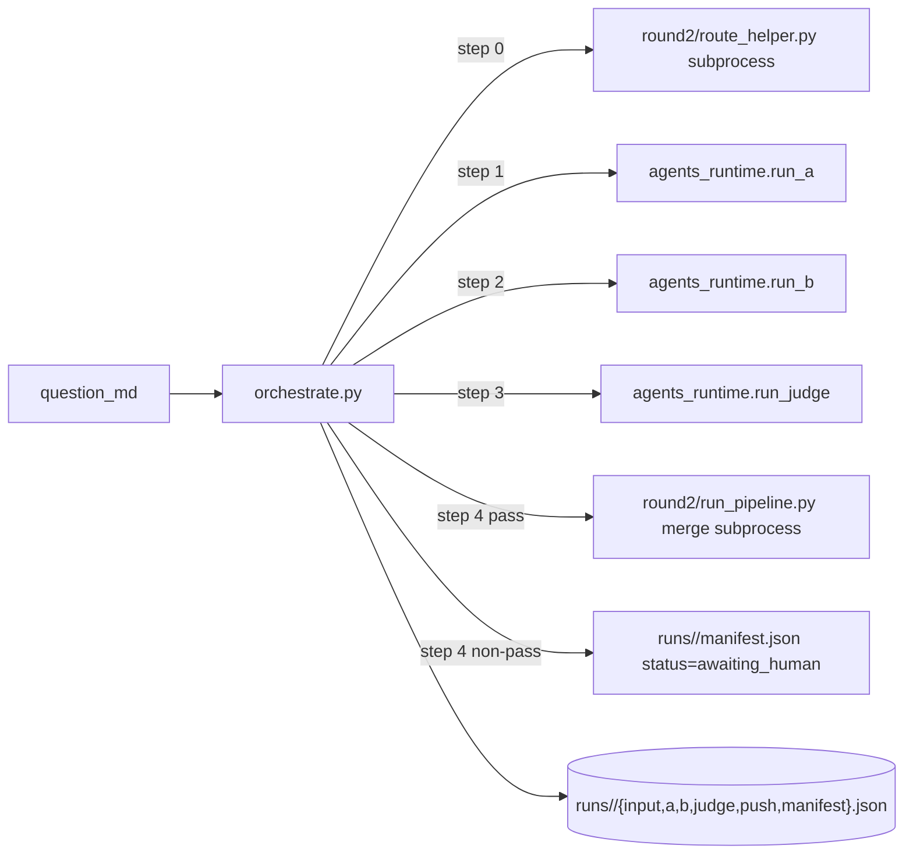

# Plan：Phase 2 — orchestrator（单 case A→B→Judge→push 串链）

> **触发源**：[`plan-chat-to-code-api.md`](plan-chat-to-code-api.md) §5.2。
> **状态**：待实施；强依赖 Phase 1 已交付（`agents_runtime.{run_a,run_b,run_judge}` 可 import）。
> **预计交付**：单次 workhorse session（0.5-1 天）。
> **本 plan 的标准**：workhorse 仅读本 plan + §2 必读列表，即可独立完成 Phase 2 全部代码。**不需要回看 master plan 也不需要回看 Phase 1 plan**——只需要把 Phase 1 当 black-box import。
>
> **第一性原理**：chat 模式下人类做的 3 件事——(1) 在 chat 之间复制 JSON ferrying，(2) 跑 route_helper / 取 existing_card 这类 plumbing，(3) verdict=pass 后调 merge——全部由 orchestrate.py 一行 CLI 接管。失败时把状态留在 `runs/<run_id>/` 给人类（或 Phase 4 的 inbox）排查；成功时直接推到 v3 md + chains.json + UI。

---

## 0. 模块定位



**单一职责**：单 case 跑通 + 状态全 physicalize 到 `runs/<run_id>/`。**不做**批量评估（Phase 3）、不写 UI（Phase 4）、不做 retrieval（Phase 5）、**也不**重写 round2 / agents_runtime 的内部逻辑。

---

## 1. 验收标准（可测试 checklist）

- [ ] `python -m agents_runtime.orchestrate 外部source/球场垃圾话应对策略.md` 跑通全链；末尾打印 run_id + 完成的 stages + 最终 verdict + UI URL（若 pass）
- [ ] 跑完后 `runs/2026-MM-DD_ball-trash-talk_<hash>/` 含 `input.json` / `route_helper.json` / `a.json` / `b.json` / `judge.json` / `manifest.json`（pass 时多 `push.json`）
- [ ] 跑 `route=update` 类 case（用 IC-012 关联 question_md）：A 输出 route=update 后 orchestrator **自动**从 `data/chains.json` 抽 target_ic_id 对应卡填进 B / Judge 的 existing_card 参数——人类 0 次手动贴
- [ ] 中途 `Ctrl+C` 后 `python -m agents_runtime.orchestrate --resume <run_id>` 能从下一未完成 stage 继续（不重跑已完成 stage；判依据：每 stage 完成时把 `manifest.json.completed_stages` append 当前 stage 名）
- [ ] 任一 stage 失败：`manifest.json` 含 `last_stage` / `last_error` / `next_action`；orchestrator 非 0 exit；**不**继续往下跑
- [ ] verdict==pass 时：orchestrator 自动调 `round2/run_pipeline.py merge --b <runs/.../b.json> --judge <runs/.../judge.json> [--mode update]`；mode 由 `b.output_kind` 选（full_card → 不传 / update_entry → update / meta_card → 报 mode_not_implemented abort）
- [ ] verdict ∈ {conditional_pass, fail} 时：不调 merge；`manifest.json.status = "awaiting_human"`；打印一行提示"前往 inbox（Phase 4）或手工 review runs/<run_id>/"
- [ ] `--no-push` flag：即便 pass 也不调 merge；用于 dry-run / 调试
- [ ] `--from <stage>` flag：必须配合 `--resume <run_id>`；强制从指定 stage 开始重跑（覆盖该 stage 及之后产物）
- [ ] 3 个历史 question_md（球场垃圾话 / 内卷正和博弈 / IC-012 关联场景）跑通；与 [`agents/runs/run_2026-05-*`](agents/runs/) chat 模式产物对照 verdict 同向（pass / conditional_pass 一致；fail 则 fail_reasons 维度集合一致）

---

## 2. 必读输入（context curation — MUST read）

| 路径 | 读哪部分 | 用途 |
|---|---|---|
| 本 plan | 全文 | 实施依据 |
| `agents_runtime/__init__.py` + `agents_runtime/agents.py` | 仅读 `run_a` / `run_b` / `run_judge` 的函数签名与 docstring | Phase 1 已交付的接口；**不读 implementation** |
| [round2/run_pipeline.py](round2/run_pipeline.py) | `cmd_merge` 函数（115-行附近）+ exit code 表 | 你要 subprocess 调它；理解 --mode / --dry-run / 退出码语义 |
| [round2/route_helper.py](round2/route_helper.py) | 仅 CLI 接口 + JSON 输出 schema | 你要 subprocess 调它取 routing |
| [round2/route_helper.spec.md](round2/route_helper.spec.md) | §2 接口契约 / §3 JSON 输出 schema | 理解 stdout JSON 形状 |
| [agent第二轮/push.prompt.md](agent第二轮/push.prompt.md) | §2 task 4 步 + §6 失败模式表 | code+api 模式下 orchestrator **替代** push.prompt 的 runbook 心智职责；你按它的纪律实施（不擅自把 conditional_pass 当 pass / verdict 闸门优先 / 失败时 structured failure 给上层）但**用 subprocess 调 merge** 而非走 LLM |
| [data/chains.json](data/chains.json) | 仅顶层 wrapper 结构（`{"meta": {...}, "chains": [{id, ...}, ...]}`）；不通读 23 张卡内容 | route=update 时用 id 在 `chains` 列表里索引取 existing_card |
| [agents/runs/run_2026-05-11_pipeline-a_ball-trash-talk.json](agents/runs/run_2026-05-11_pipeline-a_ball-trash-talk.json) | 全文 | 理解 A 输出 schema（route / target_ic_id / update_directives / raw_answer_seeds 字段名） |
| [agents/runs/run_2026-05-12_pipeline-b_ball-trash-talk.json](agents/runs/run_2026-05-12_pipeline-b_ball-trash-talk.json) | 全文 | 理解 B 输出 schema（output_kind 三态） |
| [agents/runs/run_2026-05-12_judge_ball-trash-talk.json](agents/runs/run_2026-05-12_judge_ball-trash-talk.json) | 全文 | 理解 Judge 输出 schema（verdict 三态） |

---

## 3. 禁读列表（MUST NOT read）

| 路径 | 为什么不读 |
|---|---|
| `agent第二轮/pipeline-a-diagnose.prompt.md` / `pipeline-b-style.prompt.md` / `judge.prompt.md` | **Phase 1 已包装为 callable**；你只 import；读 prompt 会让你想"自己再判一下 verdict 对不对"——那是越权 |
| `agent第二轮/conventions.md` | 同上 |
| `回答版本explore/*.md` / `context/*.md` / `外部source/*.md` | 你不做语义判断；这些文件只是 question_md / fewshot 路径出现在你的 input/output 字典里 |
| `inquiry-chain-demo-v3-good-answer.md` | 同上 |
| `crystallization-prototype/*` | Phase 4 的事 |
| `agents_runtime/loader.py` / `llm_client.py` / `context_builder.py` | Phase 1 internals；你只调三个 run_* 函数 |
| `tools/llm_api.py` | 你不直接调 LLM；orchestrate 是 plumbing 不是 reasoning |
| [agentflow3-tocode/plan-chat-to-code-api.md](agentflow3-tocode/plan-chat-to-code-api.md) **master plan** | 本 plan 已抽全所需信息 |
| [agentflow3-tocode/phase1-prompt-callable.plan.md](agentflow3-tocode/phase1-prompt-callable.plan.md) | 同上；Phase 1 已交付，看接口即可 |
| 其他 phase plan | 同上 |
| `agent第二轮/plan-update-append-mode.md` | 正交工程；append-only 的契约已经在 B prompt + run_pipeline.py merge --mode update 里落地，你只需 passthrough output_kind 选 mode |

---

## 4. 交付物清单

### 4.1 新增文件

| 路径 | 行数预估 | 单一职责 |
|---|---|---|
| `agents_runtime/orchestrate.py` | 250-350 | CLI + 单 case 串链 + resume + manifest 管理 |
| `agents_runtime/run_state.py` | 80-120 | `RunState` dataclass + `load_run` / `save_run` / `update_manifest` 工具 |
| `agents_runtime/_subprocess.py` | 60-100 | 调 round2/{route_helper,run_pipeline}.py 的薄壳；统一 stderr 捕获 / exit code 解析 |
| `agents_runtime/tests/test_run_state.py` | 60 | RunState 序列化 / resume 逻辑 |
| `agents_runtime/tests/test_orchestrate_dry.py` | 100-150 | mock run_a/b/judge + subprocess，跑完整 dry-run 链 |

### 4.2 新增目录

- `runs/` —— 第一次运行时由 orchestrate 自动 mkdir；**workhorse 不需要手动创建空目录**
- `runs/.gitignore` —— 写入 `*`（runs 全部不入 git；状态本地）

### 4.3 修改文件

- **无**。Phase 2 不动任何现有文件。

---

## 5. 实现要点（API spec / 数据流）

### 5.1 run_id 与目录形态

```
runs/
└── 2026-05-17_ball-trash-talk_a3f9c2/
    ├── manifest.json              # run 元信息 + completed_stages
    ├── input.json                 # 原始 CLI 参数 + question_md path
    ├── route_helper.json          # round2/route_helper.py stdout
    ├── a.json                     # run_a 输出
    ├── b.json                     # run_b 输出
    ├── judge.json                 # run_judge 输出
    ├── push.json                  # 仅 verdict==pass 时存在；含 merge 命令 + exit code + stderr 摘要
    └── _debug/                    # llm_client retry 时的 raw text 落盘点
        └── parse_fail_*.txt
```

**run_id 生成**：

```python
def make_run_id(question_md_path: str) -> str:
    today = date.today().isoformat()                           # 2026-05-17
    slug  = Path(question_md_path).stem                        # 球场垃圾话应对策略
    slug  = re.sub(r"[^\w\u4e00-\u9fa5-]+", "-", slug).strip("-")[:40]
    short = hashlib.sha1(f"{today}_{slug}_{time.time()}".encode()).hexdigest()[:6]
    return f"{today}_{slug}_{short}"
```

### 5.2 manifest.json schema

```json
{
  "run_id": "2026-05-17_ball-trash-talk_a3f9c2",
  "created_at": "2026-05-17T16:30:00+08:00",
  "question_md": "外部source/球场垃圾话应对策略.md",
  "status": "running | awaiting_human | succeeded | failed",
  "completed_stages": ["route_helper", "a", "b"],
  "current_stage": "judge",
  "verdict": null,                              // 填 judge 完成后
  "human_override": null,                       // Phase 4 inbox accept 时填 "accept"
  "last_error": null,
  "next_action": null,
  "push_result": null                           // 填 merge 完成后
}
```

### 5.3 stages 定义（5 阶段固定顺序）

| order | stage 名 | 做什么 | 产物 | 失败时 next_action |
|---|---|---|---|---|
| 0 | `route_helper` | subprocess 调 `round2/route_helper.py --question <q> --include-raw-answer-excerpt`；parse stdout JSON | `runs/<id>/route_helper.json` | 检查 question_md 是否存在、chains.json 是否存在 |
| 1 | `a` | 调 `run_a(question_md, route_helper_output, fewshot=[])` | `runs/<id>/a.json` | 看 _debug/ 里的 parse fail；可能重跑 |
| 2 | `b` | 若 `a.route=="update"`：从 chains.json 抽 `a.target_ic_id` 对应卡作 existing_card；调 `run_b(a, existing_card, fewshot=[])` | `runs/<id>/b.json` | 同上 |
| 3 | `judge` | 构 `route_context = {route, target_ic_id, update_directives, raw_answer_seeds}`（仅从 a 中抽这几个字段，**不**全 passthrough）；调 `run_judge(b, route_context, existing_card)` | `runs/<id>/judge.json` | 同上 |
| 4 | `push` | 若 `judge.verdict == "pass"` 或 `manifest.human_override == "accept"`：subprocess 调 merge；否则 status=awaiting_human 终止 | `runs/<id>/push.json` 或 `manifest.status=awaiting_human` | merge exit code 解读（见 §5.5） |

### 5.4 route=update 时的 existing_card 抽取（消除 F1 痛点的关键）

```python
def _load_existing_card(chains_path: Path, target_ic_id: str) -> dict | None:
    """注意：data/chains.json 顶层是 {"meta": {...}, "chains": [...]}，要取 ['chains']"""
    data = json.loads(chains_path.read_text(encoding="utf-8"))
    for card in data.get("chains", []):
        if card.get("id") == target_ic_id:
            return card
    return None
```

若 `target_ic_id` 找不到 → stage `b` 之前 abort；manifest.last_error="existing_card_not_found"；next_action="确认 A 的 target_ic_id 是不是写错；或先 chat 模式跑一遍核对"。

### 5.5 push stage 的 mode 选择 + exit code 解读

```python
def _push_stage(b_output: dict, b_json_path: Path, judge_json_path: Path,
                runs_dir: Path, run_id: str, *, force_pass: bool = False) -> dict:
    output_kind = b_output.get("output_kind")
    if output_kind == "full_card":
        mode_args = []
    elif output_kind == "update_entry":
        mode_args = ["--mode", "update"]
    elif output_kind == "meta_card":
        return {"status": "mode_not_implemented", "next_action": "等 round2/run_pipeline.py 扩展 --mode meta；或先把 meta_card 手抄进 v3 md"}
    else:
        return {"status": "schema_fail", "next_action": "B output_kind 字段缺失或异常"}

    # 若 force_pass：写 manifest.human_override=accept；merge 本身按现有 verdict 走（push.prompt §6 反例 P1 心智：
    # accept 不是把 verdict 改成 pass，而是 orchestrator 自己绕过 verdict 闸门去调 merge——但 merge 内部仍会校验 verdict
    # 因此 force_pass 模式下需要先临时把 judge.json 的 verdict 字段覆写为 pass 再传——见下文实现陷阱）

    cmd = ["./venv/bin/python3", "round2/run_pipeline.py", "merge",
           "--b", str(b_json_path), "--judge", str(judge_json_path), *mode_args]
    result = subprocess.run(cmd, capture_output=True, text=True)
    return _interpret_merge_exit(result.returncode, result.stderr, cmd)

# 对照 round2/run_pipeline.py 的 exit code 表
def _interpret_merge_exit(code: int, stderr: str, cmd: list[str]) -> dict:
    table = {
        0: ("succeeded", None),
        1: ("schema_fail", "B 输出不符 schema 或 update_entry 子 schema 失败；回 B 改 prompt 或重跑"),
        2: ("judge_not_pass", "merge 闸门拒绝；orchestrator 不该走到这里——排查 orchestrate.push 的 verdict 闸门是否漏判"),
        4: ("md_collision", "v3 md 已含同 IC id；确认是否漏跑下一 id 或者已经入库过"),
        5: ("anchor_missing", "v3 md 缺锚点 ## 3. 这版给产品的启发；需人工恢复"),
        6: ("update_target_missing", "v3 md 中找不到 target_ic_id 或缺末尾分隔；确认 target_ic_id 与 ### 标题一致"),
        7: ("update_entry_schema_fail", "update_entry 子 schema 校验失败；回 B 改 prompt"),
    }
    status, next_action = table.get(code, ("export_fail", f"export 失败，exit={code}；可能 v3 md 已改但 chains.json 没刷新——需人工 revert md"))
    return {"status": status, "exit_code": code, "stderr_excerpt": stderr[-2000:], "cmd": cmd, "next_action": next_action}
```

**实现陷阱（force_pass）**：merge 内部会校验 `judge.verdict == "pass"`（exit 2）。orchestrator 的 `--force-pass`（或 Phase 4 inbox accept）要绕过：

- 方案 A（推荐）：accept 时 orchestrator 临时新建 `judge.json` 的 patched 拷贝 `judge.accepted.json`（verdict 字段覆写为 pass），调 merge 传 `--judge runs/.../judge.accepted.json`；manifest 记录 `human_override=accept, original_verdict=<原>`
- 方案 B：扩展 round2/run_pipeline.py 加 `--allow-human-override` flag（侵入既有代码，本 phase 不做）

**Phase 2 默认走方案 A**；方案 B 留给将来 friction 触发时再考虑。

### 5.6 resume 算法

```python
def resume(run_id: str, *, from_stage: str | None = None, force_pass: bool = False, no_push: bool = False):
    state = load_run(run_id)
    all_stages = ["route_helper", "a", "b", "judge", "push"]
    if from_stage:
        idx = all_stages.index(from_stage)
        # 截断 completed_stages
        state.completed_stages = state.completed_stages[:idx]
        # 删除该 stage 及之后的产物文件（避免下游用陈旧数据）
    next_stages = [s for s in all_stages if s not in state.completed_stages]
    for stage in next_stages:
        run_stage(stage, state)  # 内部 try/except 失败时写 manifest 并 raise SystemExit(1)
```

### 5.7 CLI signature

```bash
# 全新 case
python -m agents_runtime.orchestrate <question_md_path> [--no-push] [--fewshot-md <path>]*

# resume
python -m agents_runtime.orchestrate --resume <run_id> [--from <stage>] [--force-pass] [--no-push]

# 列出 awaiting_human runs
python -m agents_runtime.orchestrate --list-pending
```

**输出形态（成功 pass 路径）**：

```
[route_helper] ok (stdout JSON saved to runs/.../route_helper.json)
[a] ok (route=new, axis=attention)
[b] ok (output_kind=full_card)
[judge] ok (verdict=pass, avg=4.67)
[push] ok (merge exit=0, IC-0NN 已入库)
✓ 完成: runs/2026-05-17_ball-trash-talk_a3f9c2
  UI: file:///<repo>/crystallization-prototype/index.html
```

**输出形态（awaiting_human）**：

```
[a] ok
[b] ok
[judge] ok (verdict=conditional_pass, scores: mechanism=4.0, anchor=3.0, ...)
[push] skipped (verdict 非 pass；status=awaiting_human)
⚠ 待人类决策: runs/2026-05-17_<scenario>_<hash>
  打开 Phase 4 inbox 或手工 review runs/<run_id>/judge.json
```

### 5.8 失败时的 manifest 写法

每个 stage 的实施函数都用同一 wrapper：

```python
def run_stage(stage: str, state: RunState) -> None:
    state.current_stage = stage
    save_manifest(state)
    try:
        STAGES[stage](state)            # 调具体 stage fn
        state.completed_stages.append(stage)
        save_manifest(state)
    except Exception as e:
        state.status = "failed"
        state.last_error = f"{type(e).__name__}: {e}"
        state.next_action = _suggest_next_action(stage, e)
        save_manifest(state)
        raise SystemExit(1)
```

---

## 6. 不在范围（防止 workhorse 顺手做）

- ❌ **不动 round2/{run_pipeline,route_helper,next_ic_id}.py**（只 subprocess 调）
- ❌ **不动 agent第二轮/push.prompt.md**（code+api 模式让 push.prompt 退化为 chat 模式 fallback，**但 md 本体保留** — master plan §3 不动的资产纪律）
- ❌ **不写 inbox.html**（Phase 4）
- ❌ **不实施 retrieval**（Phase 5）；本 phase 调用 run_a / run_b / run_judge 时 `fewshot=[]` 或用 CLI `--fewshot-md <path>` 手传
- ❌ **不写 eval suite / 批跑**（Phase 3）
- ❌ **不重新包装 LLM 调用**（Phase 1 已经做了）
- ❌ **不重新做 verdict 评判**（push 闸门只看 verdict 字段，不读 fail_reasons / scores 重判）
- ❌ **不引入并发 / 异步**（单 case 顺序跑；asyncio 在这个 scale 是 over-engineering）
- ❌ **不引入 Pydantic**（dataclasses 够用；与 master plan §0 排除 framework 的纪律一致）
- ❌ **不写 README**

---

## 7. 失败模式 / 已知风险

| 风险 | 缓解 |
|---|---|
| route_helper.py 输出 JSON schema 升级，orchestrator 的 parse 跟不上 | 用 `dict.get()` 容错；只取 orchestrator 真正用到的字段（`route_hint` / `candidates`，其他全 passthrough 到 run_a） |
| `data/chains.json` 顶层结构变化（如未来从 list 变 dict） | `_load_existing_card` 加结构 sanity check + 友好错误 |
| subprocess 调 `./venv/bin/python3` 在不同机器路径不一 | 用 `sys.executable` 而非硬编码路径；保证 orchestrator 与 round2 子进程同 venv |
| 同一 question_md 短时间内跑两次 → run_id 哈希可能撞 | run_id 含 `time.time()` 已足够；万一撞了直接 abort，提示用户等 1 秒重跑 |
| `Ctrl+C` 在 stage 中段（subprocess 还在跑）→ subprocess 可能改了 v3 md 但 orchestrator manifest 没更新 | merge 内部已经是原子的（tmp_path + replace）；orchestrator 在 push stage 用 `try/finally` 保证 manifest 一定写入"中断"状态 |
| run_a 输出的 raw_answer_seeds 是 dict（包含 not_for_anchor 等子字段）；构 route_context 时漏掉子字段会让 Judge 失去护栏 | route_context 构造**整段透传** `a["raw_answer_seeds"]`，不抽子字段 |
| route=meta 时无 mode 可用（run_pipeline.py 尚未实施 --mode meta） | push stage 返回 `mode_not_implemented`；status=awaiting_human；不让 orchestrator 抛错——这是产品边界，不是 bug |
| Windows 路径分隔 / 中文文件名 | `pathlib.Path` 全程；slug 生成时 keep 中文（regex `\u4e00-\u9fa5`） |

---

## 8. 与其他模块的接口契约

### 8.1 上游期待（Phase 1 必须已经交付）

```python
# 这是你能用的全部 Phase 1 接口
from agents_runtime import run_a, run_b, run_judge
```

### 8.2 给下游 Phase 3 / 4 的接口

**Phase 3 eval.py** 期待能在 py 层调单 case：

```python
from agents_runtime.orchestrate import run_single_case
result = run_single_case(question_md_path, no_push=True)
# result: {"run_id": "...", "verdict": "pass", "scores": {...}, "stages_completed": [...]}
```

所以本 phase 除了 CLI 入口，**必须**还暴露 `run_single_case(question_md_path, *, no_push, force_pass, fewshot_md_paths) -> dict` 函数。CLI 内部就是调这个函数 + 打印输出。

**Phase 4 inbox.html** 期待 `runs/*/manifest.json` 形态稳定（见 §5.2 schema）；本 phase 必须严格按 schema 写 manifest，**不要**随手加 / 改字段名（前向兼容靠以后版本号字段，不靠手动改）。

### 8.3 不暴露给外部的

- `_subprocess.py` 全部
- `run_state.py` 的内部 mutation 函数
- 任何 stage 实施函数（`_route_helper_stage` / `_a_stage` / ...）

外部只用 `run_single_case` + CLI。

---

## 9. 实施顺序建议（workhorse 一次 session 内）

1. `run_state.py` + `test_run_state.py`（45 分钟）
2. `_subprocess.py` + 简单 unit 测（30 分钟）
3. `orchestrate.py` 骨架（CLI + run_stage wrapper + manifest 管理）（60 分钟）
4. 4 个 stage 实施函数（每个 20-30 分钟，共 90 分钟）
5. resume 逻辑（30 分钟）
6. `test_orchestrate_dry.py` mock 测试（60 分钟）
7. 真实跑 3 个历史 case 验收（45 分钟）

**总计**：约 6 小时。
