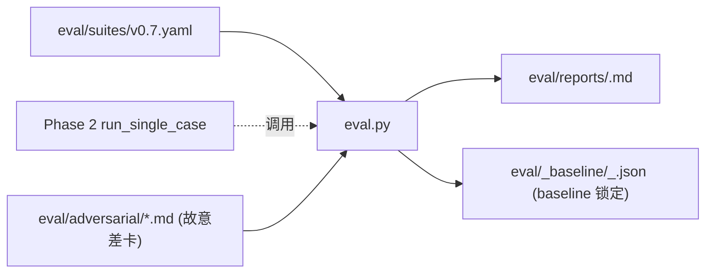

# Plan：Phase 3 — eval harness（回归测试集 + diff 报告 + adversarial 监测）

> **触发源**：[`plan-chat-to-code-api.md`](plan-chat-to-code-api.md) §5.3。
> **状态**：待实施；强依赖 Phase 2 已交付 `agents_runtime.orchestrate.run_single_case`。
> **预计交付**：单次 workhorse session（0.5 天）。
> **本 plan 的标准**：workhorse 仅读本 plan + §2 必读列表即可独立完成。
>
> **第一性原理**：改一句 prompt 想看效果不能靠"感觉"——需要一个固定 question_md 子集 + 期望路由 / 期望 axis / 期望 verdict 阈值，每次改 prompt 后批跑 + diff 上次 baseline 一目了然。**额外**：master plan §6.2 决策"全 DeepSeek 单 provider"留下了 evaluator 共谋风险——通过 adversarial_cases（故意写差的卡）监测 Judge 漏判率 < 10% 是回退到跨 provider 的硬 gate。

---

## 0. 模块定位



**单一职责**：批跑 N 个固定 case + 生成 diff 报告 + 检测 Judge 漏判率。**不做** prompt 编辑、不做模型切换、不做 retrieval 评估（那是 Phase 5 的事）。

---

## 1. 验收标准（可测试 checklist）

- [ ] `python -m agents_runtime.eval --suite eval/suites/v0.7.yaml` 顺序跑完 suite 所有 case（包含 adversarial）；并发关闭（master plan §6 拍板：先稳定再说）
- [ ] 报告 `eval/reports/<YYYY-MM-DD>_<HHMMSS>.md` 含：每 case 一行（route / axis / verdict / 6 维度 scores / 与 baseline 的 Δ）+ 总计行（pass 数 / conditional_pass 数 / fail 数 / 总 token / 总耗时 / adversarial 漏判率）
- [ ] `--baseline <run-report-or-baseline-json>` flag 加载基准；每 case 的 scores 字段显示 `4.5 (+0.0)` / `4.0 (-0.5⚠)` 格式
- [ ] 缺 baseline 时报告退化为"无对比模式"：仅列绝对分数；末尾打印 "建议保存本次为 baseline：cp eval/reports/<x>.md eval/_baseline/v0.7_<sha>.json"
- [ ] `--save-baseline <name>` flag：将本次 raw 结果存到 `eval/_baseline/<name>_<git_sha>.json` 供下次对比
- [ ] suite YAML schema：每 case 必填 `question`、`expected_route`、`expected_axis`、`expected_verdict_floor`；可选 `expected_patterns_subset`、`expected_target_ic_id`（route=update 时）
- [ ] adversarial_cases 单独 list；每条必填 `question` 与 `expected_judge_fails`（list of 6 维度名）；报告统计"漏判率" = (Judge 没把 expected_judge_fails 标进 fail_reasons.field 的次数) / (总 adversarial 数)；阈值 10%，超阈值报告顶部加红色警告 + 建议
- [ ] 3-5 个真实 case + 3 个 adversarial 一次跑通；报告人可读 + diff 对齐
- [ ] eval 跑期间任一 case orchestrator fail（如 LLM 超时 / schema 不合）→ 该 case 标记 ERROR 继续跑下一个；不让单 case fail 拖垮整 suite

---

## 2. 必读输入（context curation — MUST read）

| 路径 | 读哪部分 | 用途 |
|---|---|---|
| 本 plan | 全文 | 实施依据 |
| `agents_runtime/orchestrate.py` | 仅 `run_single_case` 函数签名与返回 dict schema | Phase 2 已交付的接口 |
| `agents_runtime/run_state.py` | `manifest.json` schema（§5.2 of Phase 2 plan）；**或** Phase 2 已写好的常量/dataclass | 解析每个 run 的产物时复用 |
| [agents/runs/run_2026-05-12_judge_ball-trash-talk.json](agents/runs/run_2026-05-12_judge_ball-trash-talk.json) | 全文 | 理解 judge_report 的 verdict / scores / fail_reasons.field 字段 |
| [agent第二轮/judge.prompt.md](agent第二轮/judge.prompt.md) | 仅 §5 6 维度评分语义表（5.1-5.7） + §4 输出 JSON 示例 | 知道 6 维度的名字与取值范围；fail_reasons.field 的典型值 |
| [agent第二轮/pipeline-a-diagnose.prompt.md](agent第二轮/pipeline-a-diagnose.prompt.md) | 仅 §4 输出 JSON 示例（axis / route / patterns 字段名 + enum 值） | 写 suite 时 expected_* 字段如何取值 |
| [context/crystallization-schema-v0.md](context/crystallization-schema-v0.md) | 仅 §4 内容 lint 5 条 + §6 反例 4 类 | 设计 adversarial_cases 时用得上（"故意写一张违反 §6.2 anchor 太长的卡"） |
| `外部source/球场垃圾话应对策略.md` | 仅作 fixture 路径 | 真实 case 1 |

**注**：worker 不需要读 Phase 1 / Phase 2 的 plan md，也不需要读 master plan。

---

## 3. 禁读列表（MUST NOT read）

| 路径 | 为什么不读 |
|---|---|
| `agents_runtime/loader.py` / `llm_client.py` / `context_builder.py` / `agents.py` | Phase 1 internals；你只调 Phase 2 的 `run_single_case` |
| `agents_runtime/orchestrate.py`（除函数签名） | 同上 |
| `round2/*.py` | Phase 2 已经包装；你只接 orchestrate 接口 |
| `agent第二轮/pipeline-b-style.prompt.md` / `push.prompt.md` / `conventions.md` | 与 eval 无关 |
| `回答版本explore/*.md` / `context/raw-questions-synthesis.md` / `context/crystallization-style-agent-brief.md` | 与 eval 无关 |
| `crystallization-prototype/*` / `tools/*` / `data/chains.json` | 与 eval 无关 |
| [agentflow3-tocode/plan-chat-to-code-api.md](agentflow3-tocode/plan-chat-to-code-api.md) **master** | 本 plan 已抽全 |
| 其他 phase plan | 同上 |
| `inquiry-chain-demo-v3-good-answer.md` | Phase 5 retrieval 才需要 |

---

## 4. 交付物清单

### 4.1 新增文件

| 路径 | 行数预估 | 单一职责 |
|---|---|---|
| `agents_runtime/eval.py` | 250-350 | CLI + suite 读取 + 并发跑 + diff 计算 + 报告生成 |
| `agents_runtime/_report.py` | 100-150 | markdown 报告渲染（表格 + Δ 标注） |
| `eval/suites/v0.7.yaml` | 50-80 | 4-5 真实 case + 3 adversarial（**workhorse 写好初版**，用户后续会迭代） |
| `eval/adversarial/anchor_too_long.md` | 30-50 | 模拟用户提问导出会触发 anchor §6.2 反例的卡 |
| `eval/adversarial/micro_steps_abstract.md` | 30-50 | 模拟会触发 micro_steps §6.3 反例的卡 |
| `eval/adversarial/mechanism_with_formula.md` | 30-50 | 模拟会触发 mechanism §6.4 公式反例的卡 |
| `eval/_baseline/.gitkeep` | 0 | 占位 |
| `eval/reports/.gitkeep` | 0 | 占位 |
| `agents_runtime/tests/test_eval.py` | 100-150 | mock run_single_case 测 diff 报告生成 / adversarial 漏判率统计 |

### 4.2 修改文件

- **无**。

### 4.3 .gitignore 追加（如果根目录没有 .gitignore，**不要**主动创建）

- `eval/_baseline/*.json` —— baseline 是本地状态不入 git（除非 workhorse 跑出第一份"权威 baseline"，那是另一次 commit 决策，本 phase 不管）
- `eval/reports/*.md` —— 报告是临时产物

具体策略：在 `eval/_baseline/.gitkeep` 同目录加一个 `eval/_baseline/.gitignore` 写 `*\n!.gitignore\n!.gitkeep`；reports 同理。

---

## 5. 实现要点

### 5.1 suite YAML schema

```yaml
# eval/suites/v0.7.yaml
suite_name: v0.7
description: |
  v0.7 milestone 的固定回归集。改 A/B/Judge prompt 后跑一次，
  与 _baseline/v0.7_<sha>.json 对比，看 score / verdict / route 有无回归。

cases:
  - id: ball-trash-talk
    question: 外部source/球场垃圾话应对策略.md
    expected_route: new
    expected_axis: attention
    expected_verdict_floor: pass         # pass | conditional_pass | fail
    expected_patterns_subset: [P-EVAL, P-EFF]   # 不要求穷举，子集即可

  - id: ic-012-update
    question: 外部source/睡前刷新.md
    expected_route: update
    expected_target_ic_id: IC-012
    expected_verdict_floor: pass

  - id: inner-curl-positive-sum
    question: 外部source/内卷惯性与正和博弈思维.md
    expected_route: new
    expected_axis: judgment
    expected_verdict_floor: pass

adversarial_cases:
  - id: anchor-too-long
    question: eval/adversarial/anchor_too_long.md
    expected_judge_fails: [anchor]                # judge.fail_reasons.field 应含这些
    expected_judge_fails_min_count: 1
    expected_verdict_ceiling: fail                # judge 应判 fail；若 pass 即漏判

  - id: micro-steps-abstract
    question: eval/adversarial/micro_steps_abstract.md
    expected_judge_fails: [micro_steps, landing_pad_pairing]
    expected_judge_fails_min_count: 1
    expected_verdict_ceiling: fail

  - id: mechanism-with-formula
    question: eval/adversarial/mechanism_with_formula.md
    expected_judge_fails: [mechanism]
    expected_judge_fails_min_count: 1
    expected_verdict_ceiling: conditional_pass    # 公式偏低但不必 fail；只要 Judge 在 fail_reasons 提到
```

### 5.2 eval.py 主流程

```python
def main():
    args = parse_args()                                          # --suite, --baseline, --save-baseline
    suite = yaml.safe_load(open(args.suite).read())
    baseline = json.loads(open(args.baseline).read()) if args.baseline else None

    raw_results = {"suite": suite["suite_name"], "ts": ..., "cases": {}, "adversarial": {}}

    # 顺序跑（不并发）；每个 case 失败不中断
    for case in suite["cases"]:
        raw = _run_one_case(case, kind="regular")
        raw_results["cases"][case["id"]] = raw

    for case in suite["adversarial_cases"]:
        raw = _run_one_case(case, kind="adversarial")
        raw_results["adversarial"][case["id"]] = raw

    report_md = _render_report(suite, raw_results, baseline)
    out_path = Path("eval/reports") / f"{datetime.now():%Y-%m-%d_%H%M%S}.md"
    out_path.write_text(report_md, encoding="utf-8")

    if args.save_baseline:
        bpath = Path("eval/_baseline") / f"{suite['suite_name']}_{args.save_baseline}.json"
        bpath.write_text(json.dumps(raw_results, ensure_ascii=False, indent=2), encoding="utf-8")

    # adversarial 漏判率检查（硬 gate）
    miss_rate = _compute_adversarial_miss_rate(raw_results["adversarial"])
    if miss_rate > 0.10:
        print(f"⚠ adversarial miss_rate={miss_rate:.0%} > 10%；建议回退到跨 provider（master plan §6.2 JUDGE_FALLBACK_*）", file=sys.stderr)
        sys.exit(2)   # 非 0 给 CI / 人触发警觉

    print(f"✓ {out_path}")


def _run_one_case(case: dict, *, kind: str) -> dict:
    """调 Phase 2 run_single_case；捕获 exception 标 ERROR"""
    try:
        result = run_single_case(case["question"], no_push=True)   # eval 一律 no_push（不入库）
        return {"status": "ok", "result": result}
    except Exception as e:
        return {"status": "error", "error": f"{type(e).__name__}: {e}"}
```

### 5.3 adversarial fixture 怎么写

每个 `eval/adversarial/*.md` 是一份**模拟用户提问** + **模拟用户已经走偏的自陈**的小段 md。设计目标：让 A 给出合理 patterns/axis；让 B（按规则）应该写出违反某条 §6 反例的卡；让 Judge 在那一维度 fail。

例如 `eval/adversarial/anchor_too_long.md`（≤30 行）：

```markdown
# 触发场景

我又在 trigger 下钻牛角尖：朋友说我做事不够主动，我立刻想"我必须证明我不是被动的，但同时我也不为别人的判断而活"——这种长句一直在脑里转。

# you asked

我希望有个 anchor 能默念，能在脑子飞起来时把我拉回来。

# 我自己已经走通

我可以证明，但我不为审判而活——这句话我一直在念。
```

A 多半诊断为 axis=judgment / patterns=[P-EVAL, P-OVER]；B 多半把"我可以证明，但我不为审判而活"直接当 anchor（22 字含转折，违反 schema §6.2）；Judge 应在 fail_reasons 标 anchor。若 Judge 没标 → 漏判记一次。

**workhorse 写 fixture 的纪律**：fixture 是给 LLM 看的小段对话，**不**是给 workhorse 自己读的；workhorse 凭 schema §4 / §6 推断"什么样的提问会诱导 B 出反例卡"即可，**不要**在 fixture 里把"期待 Judge 判 fail"明示出来（那是 cheating）。

### 5.4 diff 计算 + 报告渲染

```python
def _render_report(suite, raw, baseline):
    lines = [f"# Eval report — {suite['suite_name']} @ {raw['ts']}", ""]

    # —— 真实 cases 表 ——
    lines += ["## Cases", "", "| id | route | axis | verdict | mech | anchor | steps | apc | amc | lpp | Δverdict | Δavg | err |", "|---|---|---|---|---|---|---|---|---|---|---|---|---|"]
    for cid, r in raw["cases"].items():
        ...
        lines.append("| " + " | ".join(row) + " |")

    # —— Adversarial 表 ——
    lines += ["", "## Adversarial cases", "", "| id | judge_verdict | expected_ceiling | fail_fields | hit_expected | miss? |", "|---|---|---|---|---|---|"]
    for cid, r in raw["adversarial"].items():
        ...

    # —— 总计 ——
    lines += ["", "## Summary", "", f"- regular pass: ...", f"- adversarial miss_rate: ...", f"- total tokens: ...", f"- total wall: ... s"]
    return "\n".join(lines)
```

**Δ 标注规则**：

- `4.5 (+0.0)`：与 baseline 相同
- `4.0 (-0.5⚠)`：下降 ≥ 0.5 加 ⚠
- `5.0 (+0.5✓)`：上升 ≥ 0.5 加 ✓
- baseline 无该 case → `4.5 (new)`

### 5.5 token / latency 统计

run_single_case 返回的 manifest 里应该已经能拿到（Phase 2 manifest schema 应记录每 stage 的 token 数 + latency；若 Phase 2 没记，本 phase 兼容跳过该列）。

**workhorse 实施纪律**：若发现 Phase 2 的 manifest 未含 token/latency 字段，**不**回头改 Phase 2——本 phase 报告退化为不显示 token/latency 即可，并在报告底部加一行"提示：升级 Phase 2 manifest 加 token/latency 字段后可启用此列"。

---

## 6. 不在范围

- ❌ **不并发跑 case**（顺序跑；并发是 master plan §0 排除的工程优化）
- ❌ **不引入 pytest 风格的 eval framework**（promptfoo / langsmith / deepeval 都不引入）
- ❌ **不评估 prompt 字面"哪句要改"**（diff 只展示 score 变化，"为什么变"是人类的事）
- ❌ **不自动改 prompt**（master plan §10：DSPy 这类明确不做）
- ❌ **不算 retrieval 质量**（Phase 5 的 gate；本 phase 只跑 orchestrator，fewshot 怎么取由 orchestrator/Phase 5 决定）
- ❌ **不上 CI**（本仓库目前无 CI；workhorse 不要顺手起 GitHub Actions）
- ❌ **不写 README**

---

## 7. 失败模式 / 已知风险

| 风险 | 缓解 |
|---|---|
| adversarial fixture 设计不够"诱使" LLM 走偏 → 漏判率永远是 0%（虚假安全） | fixture 经多次跑实测：若所有跑出 verdict=fail（即都被抓到），随机抽 1 个换成更难的；workhorse 初版可能需要迭代 1-2 次（记 friction 到 `agentflow3-tocode/phase3-friction.md`） |
| baseline 文件随 git history 累积膨胀 | `.gitignore` 排除 `_baseline/*.json`；用户自己决定哪份要 commit（如里程碑 baseline） |
| run_single_case 跑 5 case 累计调 LLM 15 次（5×3 stage）→ 单次 eval 成本不小 | 报告底部打印总 token + 估算 USD（按 DeepSeek 价格表硬编码常数，过时再改） |
| 5 case 顺序跑约 5-15 分钟；workhorse 在 dev 期可能没耐心跑全套 | eval 加 `--cases <id1,id2>` 过滤 flag；让 dev 期可只跑 1 个 case |
| Phase 2 改了 `run_single_case` 返回 dict 形状 | eval 用 `dict.get()` 容错；缺字段时报告该列退化为 `-` |
| adversarial 期望的 expected_judge_fails 字段名跟 Judge 实际 `fail_reasons.field` 不一致（如 "anchor" vs "crystallization.anchor"） | 实现 `_hit_expected` 时用 `.endswith()` 或 startswith 宽松匹配；初版可手观察一次实际 fail_reasons 再校准 |

---

## 8. 与其他模块的接口契约

### 8.1 上游期待

```python
from agents_runtime.orchestrate import run_single_case  # Phase 2 交付
# 返回 dict 形如：
# {
#   "run_id": "2026-...",
#   "verdict": "pass" | "conditional_pass" | "fail",
#   "scores": {"mechanism": 4.5, "anchor": 5.0, ...},
#   "fail_reasons": [{"field": "...", "rule_violated": "...", "evidence": "..."}, ...],
#   "route": "new" | "update" | "meta",
#   "axis": "judgment" | "attention",
#   "patterns": [...],
#   "target_ic_id": "IC-012" | None,
#   "stages_completed": [...],
#   "tokens_total": int | None,            # Phase 2 若未实施则缺
#   "latency_total_ms": int | None,        # 同上
# }
```

### 8.2 给下游 Phase 5 retrieval 的接口

Phase 5 的 retrieval gate 直接拿本 phase 报告 + 跑两次 eval（一次手选 fewshot，一次自动 fewshot）做差。Phase 5 plan 自己负责"如何跑 eval 切换 fewshot 源"——本 phase **不**为 retrieval 切换专门加 flag，只暴露 `--fewshot-mode {manual,auto}` 透传给 run_single_case 即可（Phase 5 完成后再回头加这个 flag）。

### 8.3 不暴露给外部的

- `_render_report` / `_compute_adversarial_miss_rate` 等内部 helper

---

## 9. 实施顺序建议（一次 session）

1. 写 `eval/suites/v0.7.yaml` 草案（30 分钟，参考 §5.1）
2. 写 3 份 adversarial fixture md（30 分钟）
3. `_report.py`（45 分钟）
4. `eval.py` 主流程 + CLI（90 分钟）
5. `test_eval.py` mock 测（45 分钟）
6. 真实跑 1 次（含 token 真实开销）；调 adversarial fixture 至漏判率反映真实情况（45-60 分钟）
7. 保存第一份 baseline（5 分钟）

**总计**：约 4-5 小时。
