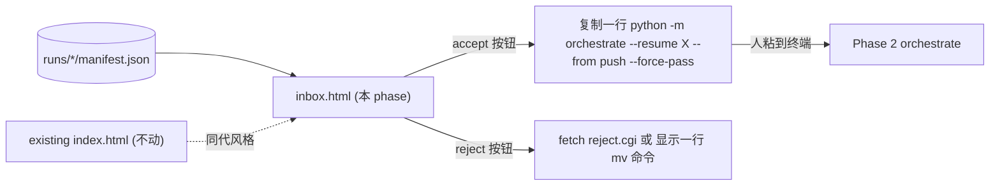

# Plan：Phase 4 — inbox UI（awaiting_human runs 的浏览器审批）

> **触发源**：[`plan-chat-to-code-api.md`](plan-chat-to-code-api.md) §5.4。
> **状态**：待实施；强依赖 Phase 2 已交付 `runs/<run_id>/manifest.json` 形态稳定。
> **预计交付**：单次 workhorse session（1 天）。
> **本 plan 的标准**：workhorse 仅读本 plan + §2 必读列表即可独立完成。前端纯 HTML+CSS+JS，**无构建工具 / 无 npm / 无框架**——与现有 `crystallization-prototype/` 保持同代风格。
>
> **第一性原理**：当前 conditional_pass / fail 的 case 散在 `runs/<run_id>/manifest.json`（master plan F4 痛点）；翻 5-10 个 json 文件用脑子聚合不可持续。inbox.html 把所有 `status=awaiting_human` 的 run 列出来；每个卡片展示 verdict / 6 维度 scores / fail_reasons / suggested_revisions，人手选 accept（复制一行命令到终端粘）或 reject（归档到 _rejected/）。

---

## 0. 模块定位



**单一职责**：纯前端 inbox 列表 + 详情折叠 + accept/reject 操作转化为复制命令（无后端）。**不做**自动入库（命令仍由人粘到终端跑——master plan §6.5 拍板：保留"人在最后一关 commit"的体感）、不做实时刷新（手动 refresh 即可）。

---

## 1. 验收标准（可测试 checklist）

- [ ] 浏览器打开 `file:///<repo>/crystallization-prototype/inbox.html` 看到列表（无后端，纯 file:// 即可加载）
- [ ] 列表来源：通过 `<script src="../runs/_index.js"></script>` 或 fetch JSON 读取（**详见 §5.1 文件加载策略**）
- [ ] 每个 run 显示：`run_id` / `question_md` 文件名 / `status` 徽章 / `verdict` 徽章 / 创建时间相对（"2 小时前"）
- [ ] 点开 run 卡片显示详情：6 维度 scores 表 / fail_reasons 列表 / suggested_revisions 列表 / "查看完整 a.json/b.json/judge.json"链接（`file://` 协议直接打开 JSON 文件）
- [ ] accept 按钮：点击后弹出一个 modal 显示**整行可点复制**的命令 `python -m agents_runtime.orchestrate --resume <run_id> --from push --force-pass`；底部 "已复制到剪贴板" 提示
- [ ] reject 按钮：modal 显示 `mv runs/<run_id> runs/_rejected/<run_id>`；并提示 "粘到终端跑完后回来 refresh 页面，该 run 会消失"
- [ ] 列表过滤：顶部 chip-row 同 `index.html` 风格 — `[All] [verdict=fail] [verdict=conditional_pass] [error]`
- [ ] 搜索框：模糊匹配 question_md 文件名 / run_id（与 index.html 同代风格）
- [ ] 主页 `index.html` 顶部加一行轻量链接 "→ inbox"（最简侵入），不动其余结构
- [ ] mobile-friendly 不做（master plan §0 排除多用户/移动端）；只在桌面浏览器 file:// 可用即可
- [ ] 颜色 / 字体 / 圆角与现有 `styles.css` 共用：复用 `:root` 里的 `--bg / --surface / --accent / --muted / --border / --radius`

---

## 2. 必读输入（context curation — MUST read）

| 路径 | 读哪部分 | 用途 |
|---|---|---|
| 本 plan | 全文 | 实施依据 |
| `runs/` 目录第一份真实 manifest.json（Phase 2 跑出来的） | 全文 | 理解字段；若 Phase 2 尚无产物，按 [`agentflow3-tocode/phase2-orchestrator.plan.md`](agentflow3-tocode/phase2-orchestrator.plan.md) §5.2 schema mockup |
| [crystallization-prototype/index.html](crystallization-prototype/index.html) | 全文（仅 90 行） | 学整体页面结构 / chip-row 模式 / dock footer |
| [crystallization-prototype/styles.css](crystallization-prototype/styles.css) | 仅 `:root` 颜色变量 + `.chip` / `.chip-row` / `.card` / `.dock` 几个类的写法（行号自找） | CSS 变量复用 + class 命名风格 |
| [crystallization-prototype/app.js](crystallization-prototype/app.js) | 前 80 行（看 chip 渲染 / event 绑定 pattern） | JS 模式参考 — 你写的 inbox.js 应该用同样 vanilla 风格 |

---

## 3. 禁读列表（MUST NOT read）

| 路径 | 为什么不读 |
|---|---|
| `agent第二轮/*.md`（任何 prompt md） | 你不渲染 prompt 内容；inbox 只看 manifest 与 judge JSON |
| `agents_runtime/*.py`（任何 phase 1/2 代码） | inbox 是纯前端，**不**调 py 函数；orchestrate 命令字符串你只是 **拼成字符串显示**，不真跑 |
| `round2/*.py` | 同上 |
| `data/chains.json` | 不显示卡库；inbox 只看 awaiting_human runs |
| `inquiry-chain-demo-v3-good-answer.md` | 同上 |
| `agents_runtime/eval.py`（Phase 3 产物） | 不依赖 |
| `agents_runtime/retrieval.py`（Phase 5） | 不依赖 |
| `tools/llm_api.py` / `tools/export_v3_chains.py` | 同上 |
| `外部source/*.md` / `回答版本explore/*.md` / `context/*.md` | 同上 |
| [agentflow3-tocode/plan-chat-to-code-api.md](agentflow3-tocode/plan-chat-to-code-api.md) **master** | 本 plan 已抽全 |
| 其他 phase plan | 同上 |
| `crystallization-prototype/chains.data.js` | 这是导出产物，不是参考资料 |

---

## 4. 交付物清单

### 4.1 新增文件

| 路径 | 行数预估 | 单一职责 |
|---|---|---|
| `crystallization-prototype/inbox.html` | 80-120 | 页面骨架（header / search / chip filters / main list / detail modal） |
| `crystallization-prototype/inbox.js` | 250-350 | 加载 manifest 列表 / 渲染 / 过滤 / accept/reject modal |
| `crystallization-prototype/inbox.css` | 100-150 | 仅 inbox 专有样式；颜色 / 圆角复用 styles.css 的 `:root` 变量 |
| `runs/_index.py` | 60-100 | 极简 py 脚本：扫 `runs/*/manifest.json` 生成 `runs/_index.js`（`window.RUN_INDEX = [...]`），供 inbox.js 同步加载 |

### 4.2 修改文件

| 路径 | 改动 |
|---|---|
| `crystallization-prototype/index.html` | 在 `<header class="top">` 底部加一行 `<a class="inbox-link" href="inbox.html">→ inbox（awaiting_human runs）</a>`；不动其他结构 |
| `crystallization-prototype/styles.css` | **不动**；inbox 用 link 进 `inbox.css` 独立样式表 |

### 4.3 不修改的关键

- `app.js` / `chains.data.js` 完全不动
- `index.html` 仅加 1 行 link（最小侵入）
- 不在 `crystallization-prototype/` 起 web server（用户偏好 `file://` 直开 — 见 `agent第二轮/push.prompt.md` §4 旁注）

---

## 5. 实现要点

### 5.1 文件加载策略（关键 — file:// 协议限制 fetch 跨目录）

浏览器 `file://` 协议下，`fetch('../runs/abc/manifest.json')` 在 Chrome 默认 **禁用**（CORS 限制 + file:// 同源策略）。两种合法路径：

**方案 A（采纳）**：用 py 脚本预生成 JS 全局变量

```python
# runs/_index.py
"""扫描 runs/ 目录，生成 runs/_index.js 供 inbox.html 加载。
人类在 dogfood 时定期手跑：python runs/_index.py
（也可在 Phase 2 orchestrate 跑完时自动调；本 phase 不强制）
"""
import json
from pathlib import Path

runs_dir = Path(__file__).resolve().parent
items = []
for manifest in runs_dir.glob("*/manifest.json"):
    if manifest.parent.name.startswith("_"):
        continue                                            # 跳过 _rejected/
    try:
        m = json.loads(manifest.read_text(encoding="utf-8"))
    except Exception:
        continue
    if m.get("status") != "awaiting_human":
        continue
    run_id = m["run_id"]
    # 内联 judge 关键字段，避免 inbox 再发请求
    judge_path = manifest.parent / "judge.json"
    judge = json.loads(judge_path.read_text(encoding="utf-8")) if judge_path.exists() else {}
    items.append({
        "run_id": run_id,
        "question_md": m.get("question_md"),
        "created_at": m.get("created_at"),
        "verdict": judge.get("verdict"),
        "scores": judge.get("scores", {}),
        "fail_reasons": judge.get("fail_reasons", []),
        "suggested_revisions": judge.get("suggested_revisions", []),
        "route": (m.get("a_summary") or {}).get("route"),    # Phase 2 可在 manifest 加 a_summary；缺则前端兜底
        "axis": (m.get("a_summary") or {}).get("axis"),
        "files": {
            "manifest": f"../runs/{run_id}/manifest.json",
            "a":        f"../runs/{run_id}/a.json",
            "b":        f"../runs/{run_id}/b.json",
            "judge":    f"../runs/{run_id}/judge.json",
        },
    })

out = runs_dir / "_index.js"
out.write_text("window.RUN_INDEX = " + json.dumps(items, ensure_ascii=False, indent=2) + ";\n", encoding="utf-8")
print(f"wrote {out} with {len(items)} awaiting_human runs")
```

inbox.html：

```html
<script src="../runs/_index.js"></script>
<script src="inbox.js"></script>
```

inbox.js 读 `window.RUN_INDEX` 即可，无需 fetch。

**方案 B（不采纳，备忘）**：Chrome 启 `--allow-file-access-from-files` —— 用户体验差，且每次刷新前要手跑脚本反而比方案 A 透明。

### 5.2 页面骨架（inbox.html）

```html
<!DOCTYPE html>
<html lang="zh-Hans">
<head>
  <meta charset="UTF-8" />
  <meta name="viewport" content="width=device-width, initial-scale=1" />
  <title>Inbox · awaiting human runs</title>
  <link rel="stylesheet" href="styles.css" />
  <link rel="stylesheet" href="inbox.css" />
</head>
<body>
  <header class="top">
    <div class="inbox-nav">
      <a href="index.html">← crystallization 主页</a>
      <span class="muted" id="last-refresh">_index.js 未加载</span>
    </div>
    <h1>Inbox · awaiting_human runs</h1>
    <p class="tagline">Phase 2 orchestrator 跑出来的 conditional_pass / fail / mode_not_implemented runs。accept 或 reject 后请 refresh 此页面。</p>
    <input id="inbox-search" type="search" placeholder="搜 question_md 文件名 / run_id…" />
    <div class="chip-row" id="verdict-chips" aria-label="按 verdict 过滤"></div>
  </header>

  <main id="run-list" aria-live="polite"></main>

  <dialog id="action-modal">
    <h3 id="action-modal-title">复制命令到终端</h3>
    <p class="muted" id="action-modal-hint"></p>
    <pre><code id="action-modal-cmd"></code></pre>
    <div class="action-modal-buttons">
      <button id="action-copy" type="button">复制</button>
      <button id="action-close" type="button">关闭</button>
    </div>
    <p id="action-copy-status" role="status"></p>
  </dialog>

  <script src="../runs/_index.js"></script>
  <script src="inbox.js"></script>
</body>
</html>
```

### 5.3 inbox.js 主结构

```javascript
const STATE = {
  runs: window.RUN_INDEX || [],
  search: "",
  verdictFilter: "all",            // all | pass | conditional_pass | fail | error
};

const $ = (sel) => document.querySelector(sel);
const $$ = (sel) => Array.from(document.querySelectorAll(sel));

function init() {
  $("#last-refresh").textContent = STATE.runs.length
    ? `已加载 ${STATE.runs.length} runs（如需更新请先跑 python runs/_index.py 再 refresh 页面）`
    : "_index.js 为空；请先跑 python runs/_index.py 生成";
  renderVerdictChips();
  renderList();
  bindEvents();
}

function renderVerdictChips() { /* 同 app.js chip 模式 */ }

function renderList() {
  const filtered = STATE.runs.filter(filterMatches);
  const root = $("#run-list");
  root.innerHTML = "";
  if (!filtered.length) {
    root.innerHTML = `<p class="muted empty">无匹配 run。</p>`;
    return;
  }
  filtered.forEach((run) => root.appendChild(renderRunCard(run)));
}

function renderRunCard(run) {
  const card = document.createElement("article");
  card.className = "run-card";
  card.innerHTML = `
    <header>
      <span class="verdict-badge verdict-${run.verdict || "unknown"}">${run.verdict || "unknown"}</span>
      <h2>${escapeHtml(run.question_md)}</h2>
      <code class="run-id">${run.run_id}</code>
      <span class="muted">${formatRelative(run.created_at)}</span>
    </header>
    <details>
      <summary>scores / fail_reasons / suggested_revisions</summary>
      ${renderScoresTable(run.scores)}
      ${renderFailReasons(run.fail_reasons)}
      ${renderSuggested(run.suggested_revisions)}
      <ul class="raw-links">
        <li><a href="${run.files.a}" target="_blank">a.json</a></li>
        <li><a href="${run.files.b}" target="_blank">b.json</a></li>
        <li><a href="${run.files.judge}" target="_blank">judge.json</a></li>
        <li><a href="${run.files.manifest}" target="_blank">manifest.json</a></li>
      </ul>
    </details>
    <div class="run-actions">
      <button class="accept" data-run="${run.run_id}">accept</button>
      <button class="reject" data-run="${run.run_id}">reject</button>
    </div>
  `;
  return card;
}

function bindEvents() {
  $("#inbox-search").addEventListener("input", (e) => {
    STATE.search = e.target.value.trim().toLowerCase();
    renderList();
  });
  document.addEventListener("click", (e) => {
    const acceptBtn = e.target.closest("button.accept");
    const rejectBtn = e.target.closest("button.reject");
    if (acceptBtn) showActionModal("accept", acceptBtn.dataset.run);
    if (rejectBtn) showActionModal("reject", rejectBtn.dataset.run);
  });
  // chip toggle, modal close, copy 等
}

function showActionModal(kind, runId) {
  const dlg = $("#action-modal");
  const cmd = kind === "accept"
    ? `python -m agents_runtime.orchestrate --resume ${runId} --from push --force-pass`
    : `mv runs/${runId} runs/_rejected/${runId}`;
  $("#action-modal-title").textContent = kind === "accept" ? "accept — 入库 / merge" : "reject — 归档";
  $("#action-modal-hint").textContent = kind === "accept"
    ? "复制下面这一行到终端跑。跑完回来 refresh 该页面，此 run 会消失。"
    : "复制下面这一行到终端跑（手动 mv 是为了你 last-mile 有反悔机会）。跑完回来 refresh 该页面。";
  $("#action-modal-cmd").textContent = cmd;
  dlg.showModal();
}

document.addEventListener("DOMContentLoaded", init);
```

### 5.4 inbox.css 关键样式

复用 `styles.css` 的 `:root` 变量（已有 `--bg / --surface / --accent / --muted / --border / --radius`）。新增：

- `.verdict-badge` 按 verdict 着色：pass 用 `--accent` 系；conditional_pass 用琥珀；fail 用赤；error 用灰
- `.run-card` 复用 `.card` 圆角 + surface 背景；左上角 verdict 徽章
- `dialog#action-modal` 居中 + 阴影 + `<pre><code>` 等宽字体
- `.inbox-nav` 顶部细 nav；返回链接 + 加载时间

**不引入新颜色变量**；如果 verdict 着色用到的色未在 `:root` —— 在 inbox.css 内部 scope 内本地写硬编码 hex，不污染全局 :root。

### 5.5 index.html 的最小侵入修改

仅在 `<header class="top">` 现有 `<p class="tagline">` 之前插入一行：

```html
<nav class="top-nav">
  <a class="inbox-link" href="inbox.html">→ inbox（awaiting_human runs）</a>
</nav>
```

`.top-nav` / `.inbox-link` 的 CSS 加进 `inbox.css`（即便主页加载 inbox.css 会让样式生效；可接受，无副作用——主页样式不被覆盖）。

**或者更稳的做法**：把这条 CSS 加到 `styles.css` 末尾（main styles）；但这违反"styles.css 不动"的纪律——**workhorse 选择 inbox.css**，让 index.html 多加一行 `<link rel="stylesheet" href="inbox.css">`（同样最小侵入，且把 inbox 相关样式聚拢一处）。

---

## 6. 不在范围

- ❌ **不起后端**（master plan §6.5 拍板：纯前端 + 命令复制；不引入 Flask / FastAPI / Express）
- ❌ **不调任何 py**（accept / reject 只是字符串拼接 + 复制；不让 inbox.js 真跑 subprocess）
- ❌ **不写实时刷新 / WebSocket / SSE**（手动 refresh 即可）
- ❌ **不引入框架**（vanilla HTML+CSS+JS；不 React / Vue / Svelte）
- ❌ **不引入构建工具**（不 npm / Vite / esbuild）
- ❌ **不改 index.html 主功能逻辑**（仅加一行 nav link）
- ❌ **不在 inbox 渲染 prompt md 内容**（你不读 prompt；只渲染 manifest + judge.json）
- ❌ **不写 README**
- ❌ **不动 chains.data.js / chains.json 的生成 / 加载逻辑**（与 Phase 4 无关）
- ❌ **不引入 mobile 响应式**（master plan 单人 dogfood / 桌面 file://）

---

## 7. 失败模式 / 已知风险

| 风险 | 缓解 |
|---|---|
| 用户忘跑 `python runs/_index.py` → inbox 看到的是陈旧列表 | header 显示 `_index.js` 加载时间 + 提示语；考虑（不在本 phase 实施）让 orchestrate 在每次写完 manifest 时自动调 runs/_index.py |
| file:// 下 fetch 跨目录被禁 | 已用方案 A 解决；不出现 fetch |
| 用户在 inbox accept 后忘 refresh → 列表里同一 run 还显示，再 accept 一次跑两次 merge | accept modal 文案明示 "跑完回来 refresh"；merge 内部有 md_collision (exit 4) 自保 |
| dialog showModal 在某些旧浏览器不支持 | `<dialog>` 在 Chrome ≥ 37 / Firefox ≥ 98 / Safari ≥ 15.4 支持；用户本地 dogfood 浏览器现代足够；不 polyfill |
| 中文 question_md 文件名 URL encode 问题 | runs/_index.js 直接存原文；inbox.js 渲染 `<a href>` 时用 `encodeURI` 包一层 |
| run 数量增长到 100+ → 列表渲染慢 | 当前 dogfood 阶段不会到；以后再加 pagination |
| reject 流程要求用户手 mv —— 可能误删 | `mv runs/<id> runs/_rejected/<id>` 是可逆的（不是 rm）；_rejected 目录用户可自查；不引入 trash 机制 |
| `_index.js` 内联 judge.json 关键字段后体积膨胀（每 run ~2 KB）→ 1000 run 时 2 MB | 当前规模无问题；以后加 paging 或 lazy load |
| Phase 2 manifest 字段不全（缺 a_summary 等） | inbox.js 用 `?.` 容错；缺字段时显示 "(unknown)"，不报错 |

---

## 8. 与其他模块的接口契约

### 8.1 上游期待（Phase 2 必须已经交付）

- `runs/<run_id>/manifest.json` 严格按 Phase 2 plan §5.2 schema 写
- 任一 run `status == "awaiting_human"` 时，`judge.json` 已存在且含 `verdict / scores / fail_reasons / suggested_revisions`
- Phase 2 manifest 推荐（**非强制**）增加一个 `a_summary: {route, axis, target_ic_id}` 字段方便前端展示 — 若 Phase 2 没加，本 phase 前端用 `?.` 兜底显示 "(unknown)"，**不**回头改 Phase 2

### 8.2 给下游 / 给用户的接口

- 用户在 inbox 看到 awaiting_human runs
- accept 操作 = 用户粘 `orchestrate --resume X --from push --force-pass`；Phase 2 已经在 §5.5 实现了 force_pass 路径
- reject 操作 = 用户粘 `mv runs/<id> runs/_rejected/<id>`；Phase 2 / Phase 3 都不读 `_rejected/`（runs/_index.py 已 skip）

### 8.3 不暴露给其他模块的

- inbox.js 全部 STATE 与函数
- runs/_index.py 是 helper script，不被 import

---

## 9. 实施顺序建议（一次 session）

1. 先手工建一份 `runs/sample/manifest.json` + `judge.json` 当 fixture（让 dev 期不依赖 Phase 2 真跑）（20 分钟）
2. `runs/_index.py` + 跑出 `runs/_index.js`（30 分钟）
3. `inbox.html` 骨架（30 分钟）
4. `inbox.css` 基础布局 + verdict-badge 配色（45 分钟）
5. `inbox.js` 加载 + 渲染 + 过滤 + 搜索（90 分钟）
6. accept / reject modal（45 分钟）
7. `index.html` 加 nav link（10 分钟）
8. file:// 真实浏览 + 手工 QA 走通 fixture（30 分钟）

**总计**：约 5 小时。

---

## 10. 给 workhorse 的 UX 暖提示（不影响验收，但会让产物更可用）

- 颜色：pass 绿 / conditional_pass 琥珀 / fail 红 / error 灰；徽章 + 卡片左 4px 色条
- 时间显示用相对（"2 小时前" / "昨天"）；hover 显示绝对 ISO
- run-card 折叠 details 默认收起（避免一屏 5 个 run 全展开）
- 复制按钮文案点击后变 "已复制 ✓" 持续 1.5s 再变回
- modal 关闭支持 ESC（dialog 默认支持）
- 搜索框 debounce 150ms（避免每按键重渲染）—— **可选**，初版不做也行
