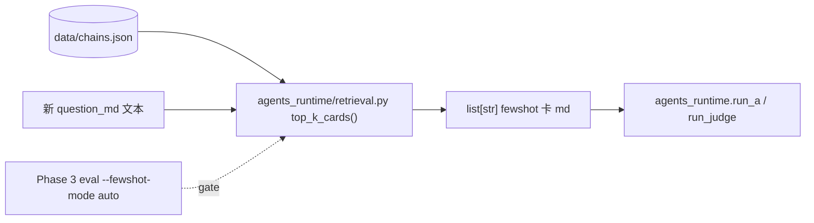

# Plan：Phase 5 — 动态 few-shot RAG（TF-IDF over chains.json）

> **触发源**：[`plan-chat-to-code-api.md`](plan-chat-to-code-api.md) §5.5。
> **状态**：待实施；**先观测再做**——本 phase 启动前 Phase 3 eval 必须已能运行，且 `--fewshot-mode {manual,auto}` 切换的对比实验是本 phase 的硬 gate。
> **预计交付**：单次 workhorse session（1 天 — TF-IDF 版；embedding 升级是另一个 plan）。
> **本 plan 的标准**：workhorse 仅读本 plan + §2 必读列表即可独立完成。
>
> **第一性原理**：人类手 @ v3 同 axis 卡作 fewshot 是 master plan F5 痛点。retrieval 用 TF-IDF over chains.json 字面相似度自动选 top-k；若 Phase 3 eval 显示自动版分数显著退化（> 0.3 平均），**fallback 到手选模式**——retrieval 函数仍然存在，但 orchestrator 默认走手选；自动 retrieval 留作可选 flag 等用户 dogfood 验证。本 phase 实施 retrieval 函数 + Phase 3 接入 + gate 评估**三件事**。

---

## 0. 模块定位



**单一职责**：纯字符匹配 + TF-IDF 相似度 + 同 axis 过滤选 k 张 v3 卡；返回**已渲染好的 md 文本字符串**给 Phase 1 的 `fewshot=[...]` 参数。**不做**embedding（升级路径在 §10）、不动 chains.json schema、不引入向量库。

---

## 1. 验收标准（可测试 checklist）

- [ ] `from agents_runtime.retrieval import top_k_cards` 可 import；签名 `top_k_cards(query: str, *, axis: str | None = None, k: int = 3) -> list[str]`
- [ ] 返回的 list[str] 每项是一张完整 v3 卡的 markdown（`### IC-XXX：标题` 起，到下一张卡前止；与 v3 md 中卡分隔约定一致）
- [ ] axis 过滤：传 `axis="attention"` 时，只在 axis=attention 的卡里算相似度
- [ ] 相同 query 多次调用结果**字面**完全一致（无随机性 —— TF-IDF 用 sklearn 时 random_state 钉住，或纯手写避免随机）
- [ ] 23 张卡 in-memory 建索引耗时 < 100 ms（不持久化；每次调用重建）
- [ ] top_k 数 k > 卡总数时自动 cap 到卡总数
- [ ] orchestrator 加 `--fewshot-mode {manual,auto}` flag；默认 `manual`（master plan §6.5 / Phase 5 §0 决议：先观测再切）
- [ ] `auto` 模式：A 调用前 `retr = top_k_cards(question_text, axis=None, k=3)`；Judge 调用前 `top_k_cards(b_anchor_text, axis=a.axis, k=2)`
- [ ] Phase 3 eval 加 `--fewshot-mode` 透传（在 Phase 3 plan §8.2 已预留）
- [ ] **Gate 实验报告**写到 `eval/reports/retrieval-gate-<date>.md`：跑 v0.7 suite 两次（manual 选定 fewshot 列表 vs auto retrieval），并列对比每 case 的 6 维度 scores；自动版平均分退化 ≤ 0.3 → gate pass；> 0.3 → gate fail，retrieval **保留**但默认不启用
- [ ] retrieval 单测：相同 query 稳定；axis 过滤生效；k cap 生效；query 为空字符串时返回空 list 而非崩

---

## 2. 必读输入（context curation — MUST read）

| 路径 | 读哪部分 | 用途 |
|---|---|---|
| 本 plan | 全文 | 实施依据 |
| [data/chains.json](data/chains.json) | 前 100 行（顶层 wrapper + 第一张卡的全字段） | 理解 schema：顶层 `{meta, chains: [...]}`；每卡含 id / title / patterns / axis / crystallization{mechanism,anchor,micro_steps} / chain{trigger,questions} / source_refs / created_at / 可选 updates[] |
| [inquiry-chain-demo-v3-good-answer.md](inquiry-chain-demo-v3-good-answer.md) | 仅前 60 行（看一张卡完整 markdown 形态） | 知道返回的 fewshot 字符串应该长什么样 |
| `agents_runtime/agents.py` | 仅 `run_a` / `run_judge` 签名（fewshot 参数类型） | Phase 1 已交付的接口 |
| `agents_runtime/orchestrate.py` | 仅 CLI 部分 + run_single_case 签名 | 知道在哪加 `--fewshot-mode` flag |
| `agents_runtime/eval.py` | 仅 `_run_one_case` 函数（Phase 3 §5.2） | 知道如何透传 fewshot_mode |

---

## 3. 禁读列表（MUST NOT read）

| 路径 | 为什么不读 |
|---|---|
| `agent第二轮/*.md`（任何 prompt md） | retrieval 与 prompt 解耦；你只是按字面找最像的卡 |
| `agents_runtime/{loader,llm_client,context_builder}.py` | Phase 1 internals；你只接 agents.py 的接口 |
| `round2/*.py` | 不相关 |
| `回答版本explore/*.md` / `context/*.md` / `外部source/*.md` | 不相关 |
| `crystallization-prototype/*` | Phase 4 的事 |
| `tools/llm_api.py` | 你不调 LLM |
| `tools/export_v3_chains.py` | 你不动 chains.json 的生成；只读 |
| [agentflow3-tocode/plan-chat-to-code-api.md](agentflow3-tocode/plan-chat-to-code-api.md) **master** | 本 plan 已抽全 |
| 其他 phase plan（**Phase 3 plan 除外** —— gate 实验需要知道 Phase 3 的 eval 接口形态） | 同上 |

---

## 4. 交付物清单

### 4.1 新增文件

| 路径 | 行数预估 | 单一职责 |
|---|---|---|
| `agents_runtime/retrieval.py` | 150-220 | TF-IDF 建索引 + 相似度计算 + axis 过滤 + 卡 md 渲染 |
| `agents_runtime/tests/test_retrieval.py` | 100-150 | 稳定性 / axis 过滤 / k cap / 空 query |
| `eval/reports/retrieval-gate-<date>.md` | 报告产物 | 不是手写文件——是跑实验时自动生成 |

### 4.2 修改文件（**最小侵入**）

| 路径 | 改动 |
|---|---|
| `agents_runtime/orchestrate.py` | 加 `--fewshot-mode {manual,auto}` CLI flag；默认 manual；auto 时在 `_a_stage` / `_judge_stage` 调用前注入 retrieval；run_single_case 加同名 kwarg |
| `agents_runtime/eval.py` | `_run_one_case` 透传 `fewshot_mode`；CLI 加 `--fewshot-mode` flag |
| `agents_runtime/tests/test_orchestrate_dry.py`（如 Phase 2 已建） | 加一条 mock 测：fewshot_mode=auto 时 run_a 被传入非空 fewshot list；mode=manual 时为空 |

### 4.3 不修改

- chains.json 不动（不加 embedding 字段；那是 §10 升级路径）
- prompt md 不动
- inquiry-chain-demo-v3-good-answer.md 不动

---

## 5. 实现要点

### 5.1 chains.json 加载（**注意 schema wrapper**）

```python
def _load_cards(chains_path: Path = None) -> list[dict]:
    """注意：chains.json 顶层是 {"meta": ..., "chains": [...]}，要取 ['chains']"""
    chains_path = chains_path or _repo_root() / "data" / "chains.json"
    data = json.loads(chains_path.read_text(encoding="utf-8"))
    return data.get("chains", [])
```

### 5.2 卡的"可检索文本"提取

每张卡的"语义代表性文本" = title + crystallization.mechanism + crystallization.anchor + crystallization.micro_steps + chain.trigger + chain.questions[]：

```python
def _card_to_search_text(card: dict) -> str:
    parts = [
        card.get("title", ""),
        card.get("crystallization", {}).get("mechanism", ""),
        card.get("crystallization", {}).get("anchor", ""),
        " ".join(card.get("crystallization", {}).get("micro_steps", [])),
        card.get("chain", {}).get("trigger", ""),
        " ".join(card.get("chain", {}).get("questions", [])),
    ]
    # updates 段也参与（轻权重；append 在后）
    for u in card.get("updates", []) or []:
        u_crystal = u.get("crystallization") or {}
        parts.extend([
            u_crystal.get("mechanism", ""),
            u_crystal.get("anchor", ""),
            " ".join(u_crystal.get("micro_steps", [])),
            " ".join(u.get("questions_appended", [])),
            u.get("trigger_addendum", ""),
        ])
    return "\n".join(p for p in parts if p)
```

### 5.3 TF-IDF 实现选择

**两个候选**：

| 候选 | 优点 | 缺点 |
|---|---|---|
| **A. sklearn `TfidfVectorizer`**（推荐） | 成熟；支持 ngram；正确处理 idf 平滑 | 引入 sklearn 大依赖；首次 import 慢 |
| B. 纯 py 手写（dict + collections.Counter） | 零依赖 | 中英混合分词麻烦；要自己写 idf；workhorse 1 天怕来不及 |

**默认 A**。`./venv` 应已有 sklearn（若无：`./venv/bin/pip install scikit-learn`；预算之内）。

**中英文分词**：用 `jieba` 做中文分词 + 空格切英文。**但 jieba 是又一个依赖**。简化方案：

- 字符级 ngram (n=2)：`TfidfVectorizer(analyzer="char_wb", ngram_range=(2,3))`——对中文 / 英文混合通用，无需分词器
- 实测在本仓库 23 张卡规模下足够区分；若验证不行再升级到 jieba

### 5.4 核心函数

```python
from pathlib import Path
import json
from functools import lru_cache
from sklearn.feature_extraction.text import TfidfVectorizer
from sklearn.metrics.pairwise import cosine_similarity

@lru_cache(maxsize=1)
def _build_index(chains_path_str: str) -> tuple[TfidfVectorizer, list[dict], "scipy.sparse.csr_matrix"]:
    """缓存按 chains.json 路径；同一进程内重复调用零开销"""
    cards = _load_cards(Path(chains_path_str))
    texts = [_card_to_search_text(c) for c in cards]
    vec = TfidfVectorizer(analyzer="char_wb", ngram_range=(2, 3), min_df=1)
    mat = vec.fit_transform(texts)
    return vec, cards, mat


def top_k_cards(query: str, *, axis: str | None = None, k: int = 3,
                chains_path: Path | None = None) -> list[str]:
    """返回 k 张最相关 v3 卡的 markdown 文本（list of str）。
    - query: 新 question_md 全文 / B anchor / 任何自然语言
    - axis: 'judgment' / 'attention'；None 时不过滤
    - k: top-k；超过总卡数自动 cap
    """
    if not query or not query.strip():
        return []
    chains_path = chains_path or _repo_root() / "data" / "chains.json"
    vec, cards, mat = _build_index(str(chains_path))
    q_vec = vec.transform([query])
    sims = cosine_similarity(q_vec, mat)[0]                  # shape (N,)
    # 按 axis 过滤
    valid_idx = [i for i, c in enumerate(cards) if axis is None or c.get("axis") == axis]
    if not valid_idx:
        return []
    # 取 valid_idx 中 sim 最高的 k 个
    valid_idx.sort(key=lambda i: -sims[i])
    chosen = valid_idx[:min(k, len(valid_idx))]
    return [_card_to_markdown(cards[i]) for i in chosen]


def _card_to_markdown(card: dict) -> str:
    """渲染单张卡为 markdown 文本；与 v3 md 中卡形态一致（用 round2/run_pipeline.py _card_to_markdown 同套模板？）
    注意：round2 的 _card_to_markdown 是 module-private（下划线开头）；本 phase **不**复用——
    你自己写一份保持解耦（round2 _card_to_markdown 改了不影响 retrieval）。
    格式参考 inquiry-chain-demo-v3-good-answer.md 中任一卡。"""
    c = card["crystallization"]
    lines = [
        f"### {card['id']}：{card['title']}",
        "",
        "**Crystallization**",
        "",
        f"机制：{c['mechanism']}",
        "",
        "入口句：",
        "",
        f"> {c['anchor']}",
        "",
        "小动作：",
        "",
    ]
    for i, s in enumerate(c["micro_steps"], start=1):
        lines.append(f"{i}. {s}")
    lines += ["", f"**Pattern tags**：{' '.join(f'`{p}`' for p in card['patterns'])}",
              "", f"**Axis**：`{card['axis']}`", ""]
    if card.get("source_refs"):
        lines.append(f"**Source refs**：{' '.join(card['source_refs'])}")
        lines.append("")
    # trigger / questions 折叠区简化保留
    lines += ["<details>", "<summary>Trigger / 追问路径</summary>", "",
              f"**Trigger**：{card['chain']['trigger']}", "", "**追问**："]
    for q in card["chain"]["questions"]:
        lines.append(f"- {q}")
    lines += ["", "</details>", ""]
    return "\n".join(lines)


def _repo_root() -> Path:
    """找含 .cursorrules 的祖先目录"""
    p = Path(__file__).resolve()
    while p != p.parent:
        if (p / ".cursorrules").exists():
            return p
        p = p.parent
    raise RuntimeError("Could not find repo root (no .cursorrules in any ancestor)")
```

### 5.5 orchestrator 接入

`agents_runtime/orchestrate.py` 改动（保持 §6 不动现有逻辑的纪律）：

```python
# CLI
ap.add_argument("--fewshot-mode", choices=["manual", "auto"], default="manual")

# run_single_case 签名加 fewshot_mode 与 fewshot_manual_paths
def run_single_case(question_md_path, *, no_push=False, force_pass=False,
                    fewshot_mode="manual", fewshot_manual_paths=None, ...):
    ...

# _a_stage 内部
if state.fewshot_mode == "auto":
    from agents_runtime.retrieval import top_k_cards
    question_text = Path(state.question_md_path).read_text(encoding="utf-8")
    fewshot = top_k_cards(question_text, axis=None, k=3)
elif state.fewshot_manual_paths:
    fewshot = [Path(p).read_text(encoding="utf-8") for p in state.fewshot_manual_paths]
else:
    fewshot = []

a_out = run_a(state.question_md_path, route_helper_output=state.route_helper_output, fewshot=fewshot, ...)

# _judge_stage 类似；用 b_output anchor 当 query；axis 过滤用 a_output.axis
```

### 5.6 Gate 实验脚本（产报告）

```bash
# 1. 跑一次 manual fewshot baseline
python -m agents_runtime.eval --suite eval/suites/v0.7.yaml --fewshot-mode manual --save-baseline retrieval-manual

# 2. 跑一次 auto fewshot
python -m agents_runtime.eval --suite eval/suites/v0.7.yaml --fewshot-mode auto --baseline eval/_baseline/v0.7_retrieval-manual.json
# 产出 eval/reports/<date>.md；diff 列即是 manual 与 auto 的对比
```

本 phase 不写专门的 gate 脚本——复用 Phase 3 的 eval 即可。但**workhorse 必须实际跑这两步**作验收的最后一步，把对比报告手动改名为 `retrieval-gate-<date>.md` 留档。

### 5.7 gate pass / fail 后的处置

- **pass（自动 ≤ 0.3 退化）**：orchestrator 的 `--fewshot-mode` 默认保持 `manual`；用户在 README / friction 里手动决定何时切到 `auto`。**不**在本 phase 自动改默认值（破坏 master plan §0 渐进式纪律）
- **fail（> 0.3 退化）**：retrieval 模块保留；orchestrator 接入也保留；CLI 默认 `manual`；在 `agentflow3-tocode/phase5-friction.md` 记一份"为什么 auto 不够好"的分析（哪些 case 选错 fewshot / 是否字符级 ngram 不够 / 是否要升级 embedding）

---

## 6. 不在范围

- ❌ **不写 embedding 版**（OpenAI / BGE / DeepSeek embedding）——升级路径在 §10，等 gate 验证 TF-IDF 不够再启动新 plan
- ❌ **不改 chains.json schema**（不加 embedding 字段）
- ❌ **不引入向量库**（faiss / qdrant / chroma / pgvector）——23 卡规模 in-memory cosine 几毫秒
- ❌ **不引入 langchain.retrievers / llama-index**（master plan §0 排除 framework）
- ❌ **不动 v3 md**
- ❌ **不动 prompt md**（fewshot 仍由 prompt frontmatter 声明位置 — 你只换内容来源）
- ❌ **不实施 hybrid（关键词 + 语义）retrieval**（这是 embedding 升级后的话题）
- ❌ **不在本 phase 自动切换 orchestrator 默认值**（gate pass 也保持 manual default — 用户手动 opt-in 才负责任）
- ❌ **不写 README**
- ❌ **不引入 jieba 中文分词器**（先用 char_wb ngram；不够再说）

---

## 7. 失败模式 / 已知风险

| 风险 | 缓解 |
|---|---|
| char_wb ngram 在中英混合 + 短文本上召回偏；同义词命中差 | gate 实验验证；不够好就降级到 manual + 记 friction |
| sklearn 引入 30 MB+ 依赖；首次 import 1-2 秒 | 接受；`@lru_cache` 让 import + build_index 只发生一次 |
| 23 张卡里同 axis 卡可能只有 5-10 张，axis 过滤后 k=3 仍有意义 | 实测；若某 axis 卡 < k 自动 cap |
| `_build_index` 缓存 key 是 chains_path 字符串；若 v3 md 改了 + export 更新 chains.json，缓存命中失效不易感知 | `_build_index` 缓存 key 加 file mtime；mtime 变化触发 rebuild |
| anchor / mechanism 含 emoji / 中英标点 → ngram 切分异常 | sklearn 默认会保留这些；接受偶发不准 |
| 用户跑 retrieval 时 chains.json 尚未生成（Phase 5 跑在 Phase 1+2 之后无问题，但 dev 测试可能在干净 repo） | `_load_cards` 文件不存在时返回 `[]`；top_k_cards 返回 `[]` 不崩 |
| Phase 1 / 2 之后 chains.json schema 变化（updates 字段已加 — append-only） | 本 phase `_card_to_search_text` 已处理 updates；以后加新字段时**默认忽略**，不会崩 |
| 同 query 高频调用时性能 | 单卡 23 行，cosine 微秒级；无需优化 |

---

## 8. 与其他模块的接口契约

### 8.1 上游期待（Phase 1 / 2 / 3 必须已经交付）

- Phase 1：`run_a(..., fewshot=...)` / `run_judge(..., fewshot=...)` 接受 `list[str]` fewshot 参数
- Phase 2：orchestrator 串链；`run_single_case` 已存在；本 phase 加 `fewshot_mode` kwarg
- Phase 3：`eval.py` 能跑 suite；本 phase 加 `--fewshot-mode` flag 透传

### 8.2 给下游（用户 + 未来 embedding 升级）的接口

```python
from agents_runtime.retrieval import top_k_cards
fewshot = top_k_cards(question_text, axis="attention", k=3)
```

接口稳定；以后换 embedding 实现时**保持签名不变**（query / axis / k 三参数），内部实现替换即可。

### 8.3 不暴露给外部的

- `_build_index` / `_load_cards` / `_card_to_search_text` / `_card_to_markdown` / `_repo_root` 全部内部 helper

---

## 9. 实施顺序建议（一次 session）

1. `_load_cards` + `_card_to_search_text` + `_card_to_markdown`（30 分钟）
2. `_build_index` + `top_k_cards`（45 分钟）
3. `test_retrieval.py`（45 分钟）
4. orchestrator 加 `--fewshot-mode` 接入 + `_a_stage` / `_judge_stage` 改 fewshot 注入（45 分钟）
5. eval.py 透传 + `--fewshot-mode` flag（20 分钟）
6. 跑 gate 实验（manual baseline + auto 对比）（45 分钟，主要是 LLM 调用耗时）
7. 写 `eval/reports/retrieval-gate-<date>.md` 留档；记 gate pass/fail（15 分钟）

**总计**：约 4 小时编码 + 1 小时 gate 实验。

---

## 10. 升级路径（明确不在本 phase 范围；备忘）

当 TF-IDF gate fail 或卡量增到 100+ 时：

1. 选 embedding：DeepSeek embedding（同 provider）/ BGE-M3（开源中文友好）/ OpenAI text-embedding-3-small（备选）
2. 在 chains.json 每张卡加 `"embedding": [float×D]` 字段（schema 加可选字段，向后兼容）
3. 写 `tools/embed_chains.py`：调一次 embedding API 把全卡 embedding 算好写回 chains.json（人手触发，非 export 自动）
4. retrieval.py 加 `top_k_cards_embed(query, ...)`：拿 query 的 embedding + cosine；保留 TF-IDF 版作 fallback
5. 重跑 gate

升级是另一个 plan（`agentflow3-tocode/plan-retrieval-embedding-upgrade.md`），**不在本 phase**。
