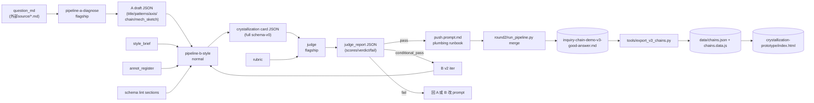

# `agents/` — L5 Agent Workflow Infrastructure

> 这个目录是把项目从 **L4 (AI Tinkerer)** 推到 **L5 (AI Builder)** 的核心基础设施。
>
> 一句话定位：**`agents/` 不是"放 prompt 的文件夹"，是把 prompt 当函数来管理的工程层**——每份 `*.prompt.md` 都有 input/output 契约、单一职责、可对比版本、明示边界。

---

## 0. 快速导览（30 秒）

```
agents/
├── README.md                           ← 你在这里
├── conventions.md                      ← 所有 prompt 必须遵守的 L5 铁律（10 条）
├── pipeline-a-diagnose.prompt.md       ← Pipeline A: Soul / 诊断 (flagship)
├── pipeline-b-style.prompt.md          ← Pipeline B: Body / 风格化 (normal)
├── judge.prompt.md                     ← LLM-as-judge / 评分 (flagship)
├── push.prompt.md                      ← Plumbing runbook / Judge pass → merge → UI (无 LLM)
└── .archive/
    └── a.v0-user-draft.md              ← 用户最初草稿，留作 L4→L5 演进对照
```

读完顺序：

1. 本 README §1 / §2（看图理解 workflow）
2. [`conventions.md`](conventions.md)（理解为什么 prompt 必须这么写）
3. 一份 prompt 文件（任意，体会一个具体例子）
4. `.archive/a.v0-user-draft.md` + 本 README §5（看 L4→L5 怎么演进）

> 本轮 chat→code 迁移工程的 plan 与进度文档分流在 [`../agentflow3-tocode/`](../agentflow3-tocode/)；本目录只保留 prompt 契约与配套规范。

---

## 1. Workflow 总览



每个方块是**一个 stateless 调用**——开新 chat、按 prompt 跑、输出 JSON 存文件、关 chat。状态在文件里，不在 chat history 里（避免 P3 状态膨胀，见 plan §1.5）。

---

## 2. Two-tier Inference + Judge：为什么这么拆

| Agent | 职责 | 模型档位 | 单次成本（粗估） | 不能合并的理由 |
|---|---|---|---|---|
| **Pipeline A** | 诊断 patterns / axis / mechanism sketch | flagship | ~$0.05-0.20 | 诊断错了下游全错——必须用最贵的脑子 |
| **Pipeline B** | 把诊断转译为合规三层 | normal | ~$0.01-0.05 | 风格化是规则密集型，normal 够用，能省 5-10x 成本 |
| **Judge** | 对 B 输出打分指出失分点 | flagship | ~$0.05-0.20 | 评分要独立判断力——用 normal 会和 B 同流合污 |

**关键设计原则**：

- 🧠 **A / Judge 用 flagship**（high-stakes：诊断错 + 评分错都是系统级失败）
- 🤖 **B 用 normal**（high-volume + 规则强：风格简报 + 标注册已经把品味固化了，normal 模型抄作业就行）
- 🚫 **不让一个 flagship 一次做完全部**（成本爆炸 + 失败无法定位 + 风格不可 fork）

这就是产品.txt §L5 第 720 行讲的 "Orchestration: 什么时候用小模型，什么时候用大模型"——v0.5 的最朴素版。

---

## 3. 调用顺序（一次完整跑通）

### Step 1: 跑 Pipeline A

**开新 Cursor chat，模型切到 thinking model**：

```
@pipeline-a-diagnose.prompt.md
@<your_question_md>.md
@crystallization-schema-v0.md
@raw-questions-synthesis.md

# v3 fewshot (3 张同 axis 或同主题卡)
<paste 3 cards>

按 prompt 跑，输出 IC chain draft JSON。
```

输出存 → `data/run_<date>_pipeline-a.json`

### Step 2: 跑 Pipeline B

**关掉 Step 1 的 chat，开新 chat，模型切到 normal**：

```
@pipeline-b-style.prompt.md
@crystallization-style-agent-brief.md
@良质回答标注册.md
@crystallization-schema-v0.md

# pipeline_a_draft
<粘 data/run_<date>_pipeline-a.json>

# v3 fewshot (1-2 张同 axis 卡)
<paste 1-2 cards>

按 prompt 跑，输出 crystallization_card JSON。
```

输出存 → `data/run_<date>_pipeline-b.json`

### Step 3: 跑 py lint

终端：

```bash
source venv/bin/activate
python tools/run_pipeline.py validate data/run_<date>_pipeline-b.json
```

- ✅ pass → 进 Step 4
- ❌ fail → 看哪个字段哪个规则违反，**回去改 B 的 prompt 或重跑**（**不要手改 JSON**！）

### Step 4: 跑 Judge

**关掉 Step 2 的 chat，开新 chat，模型切到 flagship**：

```
@judge.prompt.md
@良质回答标注册.md
@crystallization-schema-v0.md

# card to evaluate
<粘 data/run_<date>_pipeline-b.json>

# v3 reference (1-2 张同 axis)
<paste 1-2 cards>

按 prompt 跑，输出 judge_report JSON。
```

输出存 → `data/eval_runs/<date>_<card_id>_judge.json`

### Step 5: 根据 verdict 决定下一步

| Verdict | 行动 |
|---|---|
| `pass` | 跑 [`push.prompt.md`](push.prompt.md)（Step 5b）→ 一行 merge 命令完成入库 + export + UI 刷新 |
| `conditional_pass` | 看 suggested_revisions，决定是 ship 进库还是回 B v2 跑一遍 |
| `fail` | 看 fail_reasons：是 A 的诊断错（→ 改 A prompt / 重跑 A）还是 B 的风格化错（→ 改 B prompt / 重跑 B） |

### Step 5b: Push（仅 verdict==pass 时）

`push.prompt.md` 是项目里第一份 `model_tier: plumbing` 的 prompt——**不消耗 LLM token**，只是把"看 verdict → 跑 merge → 复述 UI 路径"这套人脑动作显式化，让 Cursor agent 也能按 runbook 触发。

```
@push.prompt.md

# b_output_path
agents/runs/run_<date>_pipeline-b_<scenario>.json

# judge_output_path
agents/runs/run_<date>_judge_<scenario>.json

# dry_run
false
```

或者完全跳过这份 runbook，直接在终端跑：

```bash
./venv/bin/python3 round2/run_pipeline.py merge \
    --b agents/runs/run_<date>_pipeline-b_<scenario>.json \
    --judge agents/runs/run_<date>_judge_<scenario>.json
```

两条路径等价。runbook 的价值是把闸门（先 verdict、再 exit code 分流）和反 anti-pattern（不擅自手改 JSON、不擅自把 conditional_pass 当 pass）写在 prompt 里，长期 dogfood 不漏步。

---

## 4. 你（人类）在这条 workflow 里干什么

参考 plan §0.5 的"AI 负责 / 你负责"表，复述一次：

| Step | AI 做什么 | 你做什么 |
|---|---|---|
| 跑 A | LLM 输出草稿 | 选 question_md、切模型、看 diagnostic_notes 直觉对不对 |
| 跑 B | LLM 输出卡 | 切模型、肉眼审 anchor 有没有"咯噔"感（**这一步 AI 替不了**） |
| 跑 py lint | 自动 | 看报错对哪条 schema 规则——这决定你回 A 还是回 B |
| 跑 Judge | LLM 打分 | 看 fail_reasons evidence，判断 judge 自己有没有判错（judge 也会错） |
| iter prompt | AI 起草修改 | **改 prompt 的措辞、加哪条反例**——这才是 L5 真功夫 |

**核心 mindset**：

> **AI 在这条 workflow 里是"工人"，你是"工程师 + 品味家"。你设计这条流水线、调节每个站台的工序、定品控标准；AI 在每个站台干活。你不需要会 Python 才能做这件事，但你必须有清晰的"什么是好卡"的品味。**

---

## 5. 从 [`a.v0-user-draft.md`](.archive/a.v0-user-draft.md) 到当前 v1：演进对照

用户 v0.5 启动时写了一份 8 行的 a.v0 草稿（[现存 `.archive/a.v0-user-draft.md`](.archive/a.v0-user-draft.md)）。它**不是写错了**，是**还没引入 L5 工程纪律**。下表说明 v0 → v1 每一处演进：

| L5 铁律 | a.v0 状态 | v1 状态 |
|---|---|---|
| 铁律 1（明列 input） | "阅读 @vision + @synthesis + @schema + @v3" 全文喂 | 每个 input 拆到具体章节（vision §3 / synthesis §2 / schema §2.3+§4.5+§7） |
| 铁律 2（forbidden inputs） | 无 | frontmatter 显式列禁读列表（防 P1 attention 稀释、P2 累积） |
| 铁律 4（structured output） | "生成卡片"（什么字段？什么格式？） | output schema 完整：字段 / 类型 / 长度 / 枚举 |
| 铁律 5（single responsibility） | 一个 prompt 同时做：诊断+生成卡+评分+写入 | 拆成 3 个 prompt + 1 个 py：A 诊断 / B 风格化 / judge 评分 / py 写入 |
| 铁律 6（agent 不写文件） | "根据 README 数据流分别写入" | agent 只输出 JSON；py 是唯一 writer |
| 铁律 7（agent 不自评） | "给负责审批的 agent 评分" 但流程混在一起 | judge 独立成 `judge.prompt.md`；forbidden_inputs 禁读 A/B 的 prompt（防偏） |
| 铁律 8 / 9（版本对比） | 无 frontmatter / 无 last_iter | 每份 prompt 都有 version + last_iter；旧版本进 `.archive/` |

**a.v0 的几句洞察 v1 完全保留**：

- ✅ "synthesize 已有用户情况"——v1 在 A 的 input 里保留了 raw-questions-synthesis 的关键章节
- ✅ "评分 agent"——v1 落地成独立的 `judge.prompt.md`
- ✅ "数据流写入"——v1 落地成 `tools/run_pipeline.py merge`

**L4 → L5 的本质跃迁**（用一句话总结你的演进）：

> **从"用一个全能 prompt 让 AI 自己想清楚"，到"用多个有契约的小 prompt 组成可观察、可对比、可迭代的 workflow"。**

---

## 6. Context Engineering（plan §1.5 的具体落地）

回顾 plan §1.5 那张表，在 v0.5 这条 workflow 里**每个 P 问题怎么解**：

| 问题 | 在哪一步被解 |
|---|---|
| **P1 单次 prompt 太大** | A 只读 1 份 question_md + 4 节 schema + 3 节 synthesis；B 不读原 md，只读 A 草稿 + 已压缩的 brief + annot；Judge 不读 A/B prompt | 
| **P2 历史 chain 累积** | A 第一周不喂老卡（friction 触发再上 retrieval）；Judge 只看当前一张卡 + 1-2 张 v3 fewshot |
| **P3 Agent 长对话状态膨胀** | **每个 step 开新 chat**——状态通过 `data/run_<date>_*.json` 文件传递，不留在 chat history |

---

## 7. Iter 这条 workflow 的标准动作

每周改一次 prompt（plan 周三/周四）：

1. 选一个最痛的 friction（plan §4 第二周决策）
2. 定位是 A 还是 B 还是 Judge（用 evidence——eval_runs 报告 + friction 体感）
3. **复制旧版本到 `.archive/<agent>.v<N>.prompt.md`**（铁律 9）
4. 在新版本里改一处（加 1-2 条反例、或调 1 条约束）
5. 更新 frontmatter `version` + `last_iter`
6. 在同一份 question_md 上重跑，对比 judge_report 分数
7. 提升 → 留下；下降 → 回滚

这就是产品.txt §L5 第 598 行 "Iterative Mindset" 的具体执行。

---

## 8. 反 anti-pattern：你不该做的事

| 不该做 | 为什么 |
|---|---|
| ❌ 让一个 prompt 同时做 A + B | 违反铁律 5；失败无法定位 + 成本不可控 + 风格不可 fork |
| ❌ 让 agent 直接写 chains.json | 违反铁律 6；agent 输出可能违反 schema，py lint 是最后一道闸 |
| ❌ Judge 读 A 或 B 的 prompt | 违反 forbidden_inputs；evaluator 不能被 instruction 污染 |
| ❌ 在同一个 chat 里连续跑 A → B → Judge | 违反铁律（"新 chat"）；状态膨胀 → 后面调用受前面输出污染 |
| ❌ 改 prompt 不留 archive | 违反铁律 9；半年后无法对比 |
| ❌ 一次改 A + B | 违反铁律 10；混合改动 = 没法归因提升 |
| ❌ 把"模糊感觉不行"当 fail 理由 | 必须引 schema 或 annot 的具体节 |
| ❌ Judge 给 "suggested_revisions" 时直接重写整张卡 | 越界；指方向不指答案 |
| ❌ 把 forbidden_inputs 当"建议"不当强制 | context 满那天会跪——这是物理规律不是道德 |

---

## 9. 接下来你该做什么

**立即（plan §3 Day 1 起）**：

1. 读 [`conventions.md`](conventions.md) 全文（10 分钟）
2. 读 [`pipeline-a-diagnose.prompt.md`](pipeline-a-diagnose.prompt.md)（5 分钟）
3. 按 §3 Step 1 的模板**在 Cursor 里跑一次 A**，输入用 [`外部source/认知重构：洞察底层模式.md`](../外部source/认知重构：洞察底层模式.md)
4. 把 A 输出 JSON 与 [`inquiry-chain-demo-v3-good-answer.md`](../inquiry-chain-demo-v3-good-answer.md) IC-004 卡对照，记 3 处差异到 [`friction.md`](../friction.md)

**本周（Day 1-7）**：按 plan §3 顺序完成 Day 1-7，每天对应这条 workflow 的一个站台被搭建 + 验证。

**下周**：按 friction 决定改哪个站台。

---

## 10. 文件契约

- **修改 prompt**：先备份 `.archive/`，bump version，更新 last_iter
- **修改 conventions**：写 changelog，影响所有现役 prompt——通知用户人工 review
- **新增 agent**：必须遵守 conventions.md 全部 10 条铁律 + 7 节结构
- **删除 prompt**：禁止（移到 `.archive/<agent>.deprecated-<date>.prompt.md`）
- **不允许**：把 chains.json 写入逻辑放进 agent prompt（铁律 6）；把 LLM 调用放进 py 脚本（v0.5 范围，保持 prompt-only）

---

*本目录是 v0.5 的核心。任何 agent 改动都要先读 `conventions.md`。*
